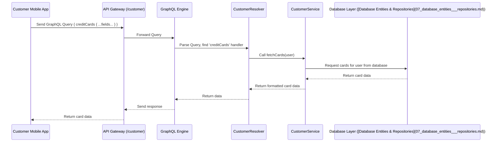

# Chapter 1: GraphQL API Endpoints

Welcome to the `credit-card-service`! This service is the engine behind managing credit cards, accounts, payments, and more. But how does our mobile app (for customers) or our internal dashboard (for admins) actually *talk* to this engine? That's where API Endpoints come in.

Imagine you're at a restaurant. You need a way to see the menu and place an order. API Endpoints are like the restaurant's system for communication:

*   **Seeing the Menu:** You need to know what food is available (like checking your account balance or card details).
*   **Placing an Order:** You need to ask the kitchen to do something (like making a payment or freezing your card).

Our `credit-card-service` uses **GraphQL API Endpoints** to handle these communications.

## What's GraphQL? Why Not Just a Simple Menu?

Think about ordering food. Sometimes you *only* want the main course, no appetizer or dessert. GraphQL is like a super-flexible ordering system where you can tell the waiter *exactly* what you want, and only get that.

*   **Traditional APIs (like REST):** Often like a fixed menu set. You ask for "user details" and might get back everything – name, address, phone, order history, shoe size... even if you only needed the name. This can be slow and wasteful.
*   **GraphQL:** You send a specific request (a "query") saying, "I want the user's name and email," and the server sends back *only* the name and email. Much more efficient!

## The Two Main Actions: Queries & Mutations

In GraphQL, there are two main ways clients interact with the service, just like looking at the menu vs. placing an order.

### 1. Queries: Asking for Information (Reading the Menu)

A **Query** is used when the client just needs to *read* or *fetch* data. It doesn't change anything on the server.

**Analogy:** Asking the waiter, "What's the current balance on my credit card?" or "Can I see my transaction history for last month?"

In our code, we define the names for these queries in a central place:

```typescript
// File: apps/credit-card-api/src/common/constants/queries.constants.ts (simplified)

export const QUERIES = {
  // ... other categories
  CARD_MANAGEMENT: {
    CREDIT_CARDS: 'creditCards', // Get a list of cards
    CREDIT_CARD: 'creditCard',   // Get details for one specific card
    // ... other card queries
  },
  TRANSACTION_MANAGEMENT: {
    CREDIT_CARD_TRANSACTIONS: 'creditCardTransactions', // Get transactions
    // ... other transaction queries
  },
  // ... other categories
};
```

This file (`queries.constants.ts`) lists all the possible "questions" clients can ask.

To handle these questions, we have special functions called **Resolvers**. Here's a simplified example of a resolver function that handles fetching account information for a customer:

```typescript
// File: apps/credit-card-api/src/modules/account-management/customer/customer.resolver.ts (simplified)

import { Resolver, Query, Context } from '@nestjs/graphql';
import { CustomerService } from './customer.service';
import { AccountInfoOutput } from '../dto'; // Defines the *shape* of the data returned
import { RequestContext, RequestedUser } from '../../../common/graphql'; // Helps identify the user

@Resolver() // Marks this class as handling GraphQL requests
export class CustomerResolver {
  constructor(private readonly customerService: CustomerService) {}

  // This function handles the 'accountInfo' query
  @Query(() => AccountInfoOutput, { description: 'Get Credit Card Account Info for Customer' })
  async accountInfo(
    @Context() ctx: RequestContext<RequestedUser> // Gets info about the request, like who the user is
  ): Promise<AccountInfoOutput> {
    // Ask the 'customerService' to fetch the actual data for this specific user
    return this.customerService.getAccountInfo(ctx.req.user);
  }
}
```

*   `@Resolver()`: Tells our system this class contains handlers for GraphQL requests.
*   `@Query()`: Decorator that marks the `accountInfo` function as the handler for a specific GraphQL Query. It also defines what kind of data (`AccountInfoOutput`) it will return.
*   `@Context()`: Gets the context of the request, which importantly includes *who* is making the request (`ctx.req.user`).
*   `customerService.getAccountInfo()`: The resolver delegates the actual work (fetching data from the database, etc.) to a dedicated `Service`.

### 2. Mutations: Making Changes (Placing an Order)

A **Mutation** is used when the client wants to *change* data or perform an *action*.

**Analogy:** Telling the waiter, "I want to make a $50 payment towards my credit card bill" or "Please freeze my lost card immediately!"

Similar to queries, we define mutation names centrally:

```typescript
// File: apps/credit-card-api/src/common/constants/mutations.constants.ts (simplified)

export const MUTATIONS = {
  // ... other categories
  CREDIT_CARD_PAYMENT: {
    MAKE_PAYMENT: 'makePayment', // Make a payment
    SETUP_AUTO_PAY: 'setupAutoPay', // Set up automatic payments
  },
  CARD_MANAGEMENT: {
    FREEZE_UNFREEZE_CARD: 'freezeUnfreezeCard', // Freeze or unfreeze a card
    ACTIVATE_CREDIT_CARD: 'activateCreditCard', // Activate a new card
    // ... other card actions
  },
  // ... other categories
};
```

This file (`mutations.constants.ts`) lists all the "actions" clients can request.

Here’s a simplified resolver handling the action to freeze or unfreeze a card:

```typescript
// File: apps/credit-card-api/src/modules/card-management/customer/customer.resolver.ts (simplified)

import { Resolver, Mutation, Args, Context } from '@nestjs/graphql';
import { CustomerService } from './customer.service';
import { FreezeUnFreezeCardInput } from '../dto'; // Defines required input data (e.g., card ID)
import { MutationResponse, RequestContext, RequestedUser } from '../../../common/graphql'; // Standard response/context types

@Resolver() // Marks this class as handling GraphQL requests
export class CustomerResolver {
  constructor(private readonly customerService: CustomerService) {}

  // This function handles the 'freezeUnfreezeCard' mutation
  @Mutation(() => MutationResponse, { // Note: @Mutation, not @Query
    name: MUTATIONS.CARD_MANAGEMENT.FREEZE_UNFREEZE_CARD, // Links to the constant name
    description: 'Freeze or Unfreeze a card for the customer',
  })
  async freezeUnfreezeCard(
    @Args({ name: 'input', type: () => FreezeUnFreezeCardInput }) // Gets the input data (e.g., which card to freeze)
    input: FreezeUnFreezeCardInput,
    @Context() ctx: RequestContext<RequestedUser> // Gets info about the user making the request
  ): Promise<MutationResponse> {
    // Ask the 'customerService' to perform the freeze/unfreeze action
    return this.customerService.freezeUnfreezeCard(input, ctx.req.user);
  }
}
```

*   `@Mutation()`: Marks this function as a handler for a GraphQL Mutation.
*   `@Args()`: Gets the data sent *with* the mutation request (e.g., the ID of the card to freeze/unfreeze, specified in `FreezeUnFreezeCardInput`).
*   `customerService.freezeUnfreezeCard()`: Again, the resolver delegates the actual work to the service.

## Different Doors for Different People: Customer, Admin, Internal Endpoints

Not everyone should be able to do everything. A customer should only see their own cards, while an admin might need to see cards for many customers.

**Analogy:** A restaurant has a main entrance and menu for customers. Staff might use a back entrance and have access to the kitchen systems. The manager might have keys to the office with financial controls.

Our `credit-card-service` provides different GraphQL API "doors" or endpoints for different types of users:

1.  **`/customer` Endpoint:**
    *   **Who uses it?** The customer mobile app.
    *   **What can they do?** View *their own* account info, cards, transactions; make payments; freeze *their own* card, etc.
    *   **Code:** Defined in `customer.module.ts`, uses resolvers like `apps/credit-card-api/src/modules/card-management/customer/customer.resolver.ts`.

2.  **`/admin` Endpoint:**
    *   **Who uses it?** The internal admin dashboard used by support staff or operations teams.
    *   **What can they do?** View information for *multiple* customers (with permission), manage cards (freeze, close, replace *for* a customer), handle disputes, manage system settings (like prime rates).
    *   **Code:** Defined in `admin.module.ts`, uses resolvers like `apps/credit-card-api/src/modules/card-management/admin/admin.resolver.ts`.

3.  **`/internal` Endpoint:**
    *   **Who uses it?** Other backend services within our company that need to interact with the credit card service directly. Not for end-users or typical admins.
    *   **What can they do?** Specific, low-level operations needed for system integration (e.g., getting raw transaction data for another service).
    *   **Code:** Defined in `internal.module.ts`.

### Security Guards: The Bouncers

How do we ensure a customer doesn't accidentally use the admin endpoint? We use **Guards**.

**Analogy:** Think of guards as bouncers at the doors (`/customer`, `/admin`) and checking IDs or permissions before letting someone perform an action.

You'll see decorators like `@UseGuards(...)` in the resolver code:

```typescript
// Snippet from apps/credit-card-api/src/modules/card-management/customer/customer.resolver.ts
// ...
@Resolver()
@UseGuards(FeatureGuard()) // Checks if the user is authenticated (logged in)
@UseFilters(GqlHttpExceptionFilter) // Handles errors nicely
export class CustomerResolver {
  // ...

  @UseGuards(AuthzGuard(RESOURCES.CREDIT_CARD_ACCOUNT, PERMISSIONS.ALL)) // Checks *permissions*
  @Query(() => CardsOutput, { /* ... */ })
  fetchCards(@Context() ctx: RequestContext<RequestedUser>): Promise<CardsOutput> {
    // ... implementation ...
  }

  // ...
}
```

*   `FeatureGuard`: Checks basic authentication (is this a valid, logged-in user or admin?).
*   `AuthzGuard`: Checks specific *permissions* (e.g., does this admin have permission to *close* a card, or only *view* it?). We define Resources (like `CREDIT_CARD_ACCOUNT`) and Permissions (like `READ`, `UPDATE`, `ALL`).

These guards ensure only authorized users can access specific queries or mutations.

## How it Works Under the Hood (Simplified)

Let's trace a simple request: A customer opens their app and wants to see their credit card list (`creditCards` query).



1.  **Request:** The mobile app sends a GraphQL query to the `/customer` endpoint.
2.  **Gateway & GraphQL Engine:** The request hits our API Gateway, which routes it to the GraphQL engine configured for `/customer`. The engine parses the query.
3.  **Resolver:** The engine identifies that the `creditCards` query is handled by the `fetchCards` method in `CustomerResolver` (shown below).
4.  **Context:** The `@Context()` decorator provides the resolver with information about who made the request (`ctx.req.user`). This is crucial for fetching the *correct* user's cards.
5.  **Service:** The resolver calls the `customerService.fetchCards()` method, passing the user information.
6.  **Business Logic & Data:** The `CustomerService` contains the core logic. It interacts with the [Database Entities & Repositories](07_database_entities___repositories.md) to fetch the card data for that specific user from the database.
7.  **Response:** The data travels back through the service and resolver to the GraphQL engine, which formats the response according to the fields requested in the original query. This response is sent back to the mobile app.

Here's that `fetchCards` resolver again, showing the call to the service:

```typescript
// File: apps/credit-card-api/src/modules/card-management/customer/customer.resolver.ts (simplified snippet)

  // ... inside CustomerResolver class ...

  @UseGuards(AuthzGuard(RESOURCES.CREDIT_CARD_ACCOUNT, PERMISSIONS.ALL)) // Checks permissions
  @Query(() => CardsOutput, { // Handles the 'creditCards' query
    name: QUERIES.CARD_MANAGEMENT.CREDIT_CARDS,
    description: 'Fetch Active Cards List For Customer',
  })
  fetchCards(
    @Context() ctx: RequestContext<RequestedUser> // Gets the user making the request
  ): Promise<CardsOutput> {
    // Delegate the actual work to the CustomerService
    // Pass the user object so the service knows *whose* cards to fetch
    return this.customerService.fetchCards(ctx.req.user);
  }
```

And the `RequestContext` tells us about the user:

```typescript
// File: apps/credit-card-api/src/common/graphql/request-context.interface.ts (simplified)

export type RequestedUser = {
  id: string; // The user's unique ID
  businessId: string; // The business associated with the user
  // ... other user properties like name, email
};

// ... other types for AdminUser, etc.

export interface RequestContext<T extends RequestedUser | RequestedAdminUser = RequestedUser> extends GqlExecutionContext {
  req: { // Represents the incoming request
    user: T; // Holds the data for the authenticated user (customer or admin)
    requestId: string; // A unique ID for tracking this specific request
  };
}
```

This context is vital for security and ensuring the service layer operates on the correct data.

## Conclusion

You've learned about the foundation of how clients interact with the `credit-card-service`:

*   **GraphQL API Endpoints:** The communication channels (like `/customer`, `/admin`).
*   **GraphQL:** A flexible way to request *exactly* the data needed.
*   **Queries:** Used for fetching data (reading the menu).
*   **Mutations:** Used for changing data or performing actions (placing an order).
*   **Resolvers:** Functions that handle specific queries and mutations, often delegating work to Services.
*   **Security:** Guards protect endpoints and actions, ensuring only authorized users can proceed.
*   **Different Endpoints:** Tailored access for Customers, Admins, and Internal services.

Now that you understand *how* the mobile app or admin dashboard communicates with the service, let's dive into one of the core features this communication enables: managing the lifecycle of a credit card itself.

**Next:** [Card Management Lifecycle](02_card_management_lifecycle.md)

---

Generated by [AI Codebase Knowledge Builder](https://github.com/The-Pocket/Tutorial-Codebase-Knowledge)