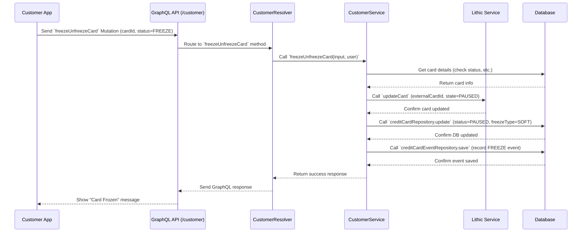

# Chapter 2: Card Management Lifecycle

In [Chapter 1: GraphQL API Endpoints](01_graphql_api_endpoints.md), we learned how our apps talk to the `credit-card-service` using GraphQL Queries (to ask for information) and Mutations (to make changes). Now, let's dive into one of the most fundamental jobs of this service: managing the credit card itself, from its birth to its eventual retirement.

## What's a Card's Lifecycle?

Think about getting a driver's license. There's a whole process:

1.  **Applying:** You apply for a license.
2.  **Issuing:** The DMV creates and issues your physical license card.
3.  **Activating:** You might need to do something to make it officially valid (less common for licenses, but stick with the analogy!).
4.  **Using:** You use it to drive.
5.  **Managing:** Maybe you misplace it and need to temporarily report it (like freezing a card).
6.  **Replacing:** If you lose it permanently or it gets damaged, you get a replacement.
7.  **Expiring/Closing:** Eventually, it expires, or maybe you move and cancel it.

A credit card in our system has a very similar journey! The **Card Management Lifecycle** covers all the operations related to the card *itself*, not the money moving around (we'll cover that later). It's like the DMV for your credit card.

This includes:

*   Creating brand new cards (virtual or physical).
*   Activating a physical card once you receive it in the mail.
*   Temporarily freezing (pausing) a card if you misplace it, and unfreezing it when you find it.
*   Replacing a card if it's lost, stolen, damaged, or expired.
*   Permanently closing a card when it's no longer needed.

## The Main Stages of a Card's Life

Let's look at the key actions involved in managing a card within the `credit-card-service`.

### 1. Creating a Card

This is how a card comes into existence. A customer (or sometimes an automated process) requests a new card. We support two types:

*   **Virtual Cards:** These exist only digitally. They're great for online spending and can often be created instantly.
*   **Physical Cards:** These are the plastic cards you get in the mail. They take time to produce and ship.

**How it happens:**

*   The mobile app (or admin dashboard) sends a `createCard` **Mutation** via the [GraphQL API Endpoints](01_graphql_api_endpoints.md).
*   The service talks to our card issuing partner, **Lithic**, to actually create the card record on their systems ([Lithic Service Integration](06_lithic_service_integration.md)).
*   The service saves the new card's details (like the last four digits, type, and initial status) in our own database ([Database Entities & Repositories](07_database_entities___repositories.md)).
*   For physical cards, creating the card in our system triggers a background job to handle the details of ordering it from Lithic ([Asynchronous Workers (RabbitMQ)](08_asynchronous_workers__rabbitmq_.md)).

Here's a peek at the service logic that handles creating a *virtual* card:

```typescript
// File: apps/credit-card-api/src/modules/card-management/common/services/create-credit-card.service.ts (simplified)

async createVirtualCard(userId: string, businessId: string, creditCardAccountId: string): Promise<ICreateCardResponse> {
  // ... (check if user is allowed to create a virtual card) ...

  const userFullName = await this.getUserFullName(userId);
  const lithicAccountToken = await this.getLithicAccountToken(userId); // Get user's Lithic ID
  const newCardId = randomUUID(); // Create a unique ID for our database
  const expiryDate = getDefaultExpiryForNewCard(); // Calculate expiry date

  // Prepare instructions for Lithic
  const payload: Lithic.Cards.CardCreateParams = {
    memo: newCardId, // Link Lithic card to our ID
    exp_month: expiryDate.split('-')[1],
    exp_year: expiryDate.split('-')[0],
    type: LithicCardType.VIRTUAL,
    account_token: lithicAccountToken,
    state: LithicCardStatus.OPEN, // Virtual cards start active
    // ... other details like card art ...
  };

  // 1. Tell Lithic to create the card
  const newCardFromLithic = await this.lithicService.createCard(payload);

  // 2. Save the card details in our database
  const dbCard = await this.cardsRepository.save({
    id: newCardId,
    externalCardId: newCardFromLithic.token, // Lithic's ID for the card
    lastFour: newCardFromLithic.last_four,
    expiry: expiryDate,
    userId: userId,
    businessId: businessId,
    type: CardType.VIRTUAL,
    status: CardStatus.OPEN, // It's ready to use
    isActivated: true, // Virtual cards don't need separate activation
    // ... other details ...
  });

  // 3. Record this event (useful for history/auditing)
  await this.cardEventsRepository.save({ /* ... event details ... */ });

  // ... (track event with Rudderstack) ...

  return { id: dbCard.id, type: dbCard.type }; // Return our ID and type
}
```

This code first asks Lithic (our card issuer partner) to create the card record, then saves the important details, like Lithic's unique ID (`externalCardId`) and the last four digits, into our own database.

### 2. Activating a Physical Card

When a physical card arrives in the mail, it's usually inactive for security. The customer needs to confirm they've received it before it can be used.

**How it happens:**

*   The customer uses the mobile app, enters maybe the last four digits and expiry date shown on the physical card.
*   The app sends an `activateCreditCard` **Mutation**.
*   The service checks if the details match the card we have on record in our database.
*   If they match, the service tells **Lithic** to change the card's state to `OPEN`.
*   The service updates the card's status in our database to `OPEN` and marks `isActivated` as true.

```typescript
// File: apps/credit-card-api/src/modules/card-management/common/services/activate-credit-card.service.ts (simplified)

async activateCardAtIssuer(card: CreditCards, userId: string) {
  // Tell Lithic to make the card usable
  const payload = {
    state: LithicCardStatus.OPEN, // Set status to OPEN (active)
    memo: card.id, // Reference our internal card ID
  };
  await this.lithicService.updateCard(payload, userId, card.externalCardId);
  this.loggerService.info('ACTIVATE_CARD', 'Card Activation at Issuer is successful');
}

async activateCardInDB(cardId: string, card: CreditCards, userId: string, businessId: string, transactionManager: EntityManager) {
  // Update our database record
  await this.cardsRepository.update(cardId, { status: CardStatus.OPEN, isActivated: true }, transactionManager);

  // Record the activation event
  const event = { /* ... event details ... */ };
  await this.cardEventsRepository.save(event, transactionManager);
  this.loggerService.info('ACTIVATE_CARD', 'Card is marked activated');
}
```

Here, `activateCardAtIssuer` tells Lithic the card is ready, and `activateCardInDB` updates our local record.

### 3. Freezing and Unfreezing a Card

If a customer misplaces their card, they can temporarily "freeze" or "pause" it. This prevents anyone from using it. If they find it later, they can "unfreeze" it.

**How it happens:**

*   The customer taps "Freeze Card" in the app.
*   The app sends a `freezeUnfreezeCard` **Mutation** with the desired status (freeze/unfreeze).
*   The service tells **Lithic** to update the card's state (`PAUSED` or `OPEN`).
*   The service updates the card's `status` in our database. We also store a `freezeType` (e.g., `SOFT` for customer-initiated freeze, `HARD` might be for fraud cases handled by admins).

```typescript
// File: apps/credit-card-api/src/modules/card-management/customer/customer.service.ts (simplified)

async freezeUnfreezeCard(args: FreezeUnFreezeCardInput, user: RequestedUser): Promise<MutationResponse> {
  const { id: cardId, status: requestedAction } = args; // requestedAction is FREEZE or UNFREEZE
  const { id: userId } = user;

  // Determine the status to set in DB and Lithic
  const dbStatusToUpdate = requestedAction === CardFreezeStatus.FREEZE ? CardStatus.PAUSED : CardStatus.OPEN;
  const lithicStatus = dbStatusToUpdate.toLocaleUpperCase() as LithicCardStatus;

  // ... (Check if card exists, is activated, not closed, not already in the target state) ...

  const freezeType = dbStatusToUpdate === CardStatus.OPEN ? null : CardFreezeType.SOFT;

  // 1. Update Lithic
  await this.lithicService.updateCard({ state: lithicStatus }, userId, creditCard.externalCardId);

  // 2. Update our Database
  await this.creditCardRepository.update(cardId, { status: dbStatusToUpdate, freezeType });

  // 3. Record the event
  await this.creditCardEventRepository.save({ /* ... event details ... */ });

  // ... (track event, return success message) ...
}
```

This is similar to activation, but toggles between `OPEN` and `PAUSED` states both in our database and at Lithic.

### 4. Replacing a Card

Cards get lost, stolen, damaged, or expire. When this happens, the customer needs a replacement.

**How it happens:**

*   The customer (or an admin) requests a replacement via a `replaceCard` **Mutation**, specifying the reason (e.g., lost, damaged).
*   **Crucially:** Depending on the reason (e.g., lost/stolen vs. damaged/expired), the service might first need to **close** the *old* card with Lithic and in our database.
*   The service then initiates the creation of a *new* card (similar to step 1), linking it as a replacement for the old one.
*   For physical cards, this again involves an asynchronous process ([Asynchronous Workers (RabbitMQ)](08_asynchronous_workers__rabbitmq_.md)) to handle ordering the new card from Lithic.

```typescript
// File: apps/credit-card-api/src/modules/card-management/common/services/replace-credit-card.service.ts (simplified)

async replaceCard(input: ReplaceCardAdminInput, requestor: Requestor): Promise<ReplaceCardResponse> {
  // ... (Check validity: card exists, account active, not already replaced etc.) ...

  const { id: oldCardId, type, replacementReason } = input;

  // Use a database transaction to ensure all steps succeed or fail together
  dbTransaction = await this.dbTransactionFactory.createTransaction();
  await dbTransaction.startTransaction();
  const { transactionManager } = dbTransaction;

  let newCardId: string;

  if (type === CardType.PHYSICAL) {
    // === Physical Card Replacement ===
    // 1. Close the old card if needed (e.g., if lost/stolen)
    if (this.shouldCloseCurrentCard(replacementReason)) {
      await this.closeCardService.closeCardInDb(oldCardId, requestor, /* reason */, transactionManager);
      // Note: Closing with Lithic might happen here or in an async worker
    }

    // 2. Create the *request* for a new physical card in our DB
    newCardId = await this.createNewPhysicalCardInDatabase(card, address, input, requestor, transactionManager);

    // 3. Trigger async worker to actually order from Lithic
    await this.rabbitMQProducerService.pushMessage(RABBITMQ.QUEUES.REPLACE_CREDIT_CARD, { cardId: newCardId });

  } else {
    // === Virtual Card Replacement ===
    // 1. Close the old virtual card with Lithic immediately
    await this.lithicService.closeCard(card.externalCardId);
    await this.closeCardService.closeCardInDb(oldCardId, requestor, /* reason */, transactionManager);

    // 2. Create the new virtual card with Lithic and in our DB immediately
    newCardId = await this.createNewVirtualCard(card, replacementReason, requestor, transactionManager);
  }

  await dbTransaction.commitTransaction(); // Finalize changes if all steps worked

  return { /* ... response indicating success and new card details ... */ };
}
```

Replacement is more complex, often involving closing the old card and creating a new one, sometimes using background workers for physical cards.

### 5. Closing a Card

This is the final stage – permanently deactivating a card. This is usually done by administrators, perhaps when a customer closes their entire account.

**How it happens:**

*   An admin uses the dashboard, triggering a `closeCard` **Mutation**.
*   The service tells **Lithic** to close the card permanently.
*   The service updates the card's `status` to `CLOSED` in our database.

```typescript
// File: apps/credit-card-api/src/modules/card-management/common/services/close-credit-card.service.ts (simplified)

async closeCardInDb(cardId: string, requestor: Requestor, eventDescription: string, transactionManager: EntityManager) {
  // 1. Update our database status
  await this.cardRepository.update(cardId, { status: CardStatus.CLOSED }, transactionManager);

  // 2. Record the event
  await this.cardEventRepository.save(
    {
      creditCardId: cardId,
      name: CardEvent.CLOSED,
      description: eventDescription,
      requestedById: requestor.id,
      requestedBy: requestor.type,
    },
    transactionManager,
  );
  // ... (void pending transaction risks, etc.) ...
  this.loggerService.info('CLOSE_CREDIT_CARD', 'Card closed in database', { cardId });
}

// In the AdminService.closeCard method:
// ... (check card exists, not already closed) ...
// await this.closeCardService.closeCardInDb(cardId, requestor, eventDescription, transactionManager);
// await this.lithicService.closeCard(creditCard.externalCardId); // Tell Lithic to close it
// ...
```

Closing involves setting the final status in our database and informing Lithic.

## How it Works Under the Hood

Let's trace a common action like **Freezing a Card** initiated by a customer:



1.  **App Request:** The user taps "Freeze" in the app, which sends a GraphQL Mutation.
2.  **Resolver:** The API gateway routes this to the `CustomerResolver`, which finds the `freezeUnfreezeCard` function marked with `@Mutation`.
3.  **Service Logic:** The resolver calls the corresponding method in the `CustomerService`. This service contains the core business logic.
4.  **Checks:** The service might first fetch the card from the database ([Database Entities & Repositories](07_database_entities___repositories.md)) to ensure it exists and isn't already frozen or closed.
5.  **Lithic Interaction:** The service calls the `LithicService` ([Lithic Service Integration](06_lithic_service_integration.md)) to tell Lithic to update the *actual* card status to `PAUSED`. This is crucial because Lithic controls whether transactions are approved.
6.  **Database Update:** The service updates the card's `status` and `freezeType` fields in our `credit_cards` table in the database.
7.  **Event Logging:** An entry is added to the `credit_card_events` table to keep a history of what happened to the card.
8.  **Response:** The service returns a success message, which goes back through the resolver and API to the app.

This pattern (Resolver -> Service -> External Systems/Database) is common throughout the `credit-card-service`. The Service orchestrates the necessary steps, interacting with our database and external partners like Lithic.

## Conclusion

You've now seen the complete lifecycle of a credit card within our system – from creation to activation, management (freezing/unfreezing), replacement, and finally, closure. We saw how GraphQL Mutations trigger these actions, and how our services coordinate updates between our database and the external card issuer, Lithic. We also learned that some actions, particularly for physical cards, involve background processing using [Asynchronous Workers (RabbitMQ)](08_asynchronous_workers__rabbitmq_.md).

Now that we know how cards are managed, let's look at what happens when you actually *use* the card.

**Next:** [Transaction Processing (ASA & Webhooks)](03_transaction_processing__asa___webhooks_.md)

---

Generated by [AI Codebase Knowledge Builder](https://github.com/The-Pocket/Tutorial-Codebase-Knowledge)