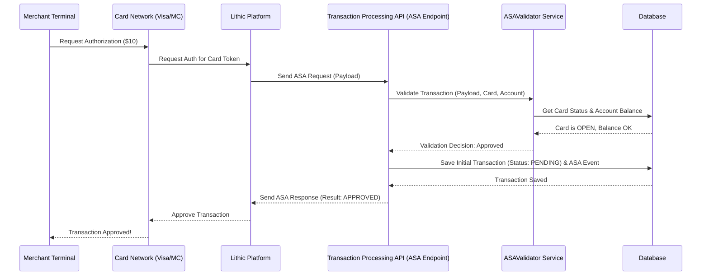
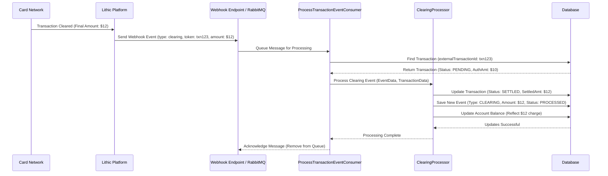

# Chapter 3: Transaction Processing (ASA & Webhooks)

In [Chapter 2: Card Management Lifecycle](02_card_management_lifecycle.md), we saw how credit cards are created, activated, managed (frozen/unfrozen), and eventually closed. But the whole point of a credit card is to *use* it! So, what happens when you actually tap your card at a store or enter its details online?

This chapter explains how our `credit-card-service` handles purchase attempts (approving or declining them in real-time) and keeps track of the transaction's journey afterwards.

## The Two Sides of a Transaction: The Moment vs. The Follow-Up

Imagine you're trying to get into an exclusive club:

1.  **The Bouncer at the Door (Real-time Decision):** When you arrive, the bouncer immediately checks your ID, your name on the list, and maybe if you meet the dress code. They make a quick decision: "Approved, go in" or "Declined, sorry." This has to happen right away.
2.  **The Club's Back Office (Later Updates):** Later that night, or maybe the next day, the club's manager might update their records. They might note exactly when you entered, confirm your final bar tab, or process a refund if you left early. This happens *after* the initial entry decision.

Transaction processing in our system works similarly, using two main mechanisms provided by our partner, Lithic:

*   **Authorization Stream Access (ASA):** This is our "bouncer." It receives requests *in real-time* when a card is used. Our service quickly checks rules (Is the card active? Are there enough funds?) and responds "Approve" or "Decline."
*   **Webhooks:** These are like "mail updates" from the club's back office. After the initial authorization, the card network sends follow-up events (like the final charge amount settling, a refund being processed, or a chargeback starting). Lithic forwards these events to our system via Webhooks, and we update our records accordingly.

Let's break down how each part works.

## ASA: The Real-Time Bouncer

When you swipe, tap, or enter your card details online, the merchant's terminal sends a request through the card network (like Visa or Mastercard) to our card issuer partner, Lithic. Lithic then immediately forwards this request to our system using the **Authorization Stream Access (ASA) API**.

**Analogy:** The cashier swipes your card, the request goes to Visa, Visa asks Lithic, and Lithic instantly calls our system's "bouncer" endpoint.

Our ASA endpoint needs to be super fast because the cashier (and you!) are waiting. It has milliseconds to decide: **Approve** or **Decline**.

### How ASA Works (Simplified)

1.  **Request Received:** Lithic sends a request (an `ILithicASARequestPayload`) to a specific endpoint in our `transaction-processing-api` service. This request contains details like the card token, amount, merchant info, etc.
2.  **Validation:** Our service immediately performs checks:
    *   Is the card token valid and does it belong to a real card in our database? ([Database Entities & Repositories](07_database_entities___repositories.md))
    *   Is the card status `OPEN` (active)? (See [Card Management Lifecycle](02_card_management_lifecycle.md)) It shouldn't be `PAUSED` (frozen) or `CLOSED`.
    *   Are there sufficient available funds/credit limit on the account?
    *   Does it pass basic fraud checks? (We use services like Sardine and internal rules - see `TransactionRiskService`).
    *   Does it pass Address Verification System (AVS) checks if applicable? (See `AVSService`).
3.  **Initial Record:** If the validation looks okay so far, we create an initial record for this transaction attempt in our database, usually marked as `PENDING`. We also record the ASA event itself.
4.  **Decision & Response:** Based on the validation checks, we construct a response (`IASAResponse`) telling Lithic whether to `APPROVE` or `DECLINE` the transaction. We might also include a reason code for declines.
5.  **Lithic & Network:** Lithic receives our response and passes the decision back through the card network to the merchant's terminal.

### Under the Hood: The ASA Flow



### Code Example: Receiving and Validating the ASA Request (Simplified)

The main entry point checks if we've seen this transaction attempt before and finds the relevant card and account.

```typescript
// File: apps/transaction-processing-api/src/modules/auth/auth.service.ts (simplified)

import { AsaAuthorizationService } from './asa-authorization.service';
// ... other imports

@Injectable()
export class AuthService {
  constructor(
    private readonly loggerService: LoggerService,
    private readonly asaValidator: ASAValidator, // Service to check rules
    private readonly creditCardRepository: CreditCardRepository, // Access card data
    private readonly accountRepository: AccountRepository, // Access account data
    private readonly asaAuthorizationService: AsaAuthorizationService, // Handles main logic
    // ... other services
  ) {}

  async auth(payload: ILithicASARequestPayload): Promise<IASAResponse> {
    const txnToken = payload.token; // Unique ID for this attempt from Lithic
    const declineResponse: IASAResponse = { /* ... default decline ... */ };

    // 1. Check if we already processed this exact request (prevent duplicates)
    if (await this.asaValidator.isAsaAlreadyProcessed(txnToken)) {
      this.loggerService.warn('AUTH_SERVICE', 'ASA request already processed', { txnToken });
      return declineResponse;
    }

    // 2. Find the card in our database using the token from Lithic
    const dbCreditCard = await this.creditCardRepository.getCreditCardByToken(payload.card.token);
    if (!dbCreditCard) { /* ... handle card not found ... */ return declineResponse; }

    // 3. Find the associated account
    const dbAccount = await this.accountRepository.getOne({ where: { businessId: dbCreditCard.businessId } });
    if (!dbAccount) { /* ... handle account not found ... */ return declineResponse; }

    // 4. Delegate to the specific authorization service based on request type
    // (Simplified: Assuming 'AUTHORIZATION' type)
    if (payload.status === 'AUTHORIZATION') {
      return this.asaAuthorizationService.asaAuthorization(payload, dbCreditCard, dbAccount);
    }
    // ... handle other statuses like 'FINANCIAL_AUTHORIZATION' ...

    this.loggerService.warn('AUTH_SERVICE', 'Unsupported status', { payload });
    return declineResponse;
  }
}
```

This `AuthService` acts as the first gatekeeper. It finds the necessary database records and then passes the request to `AsaAuthorizationService` for the heavy lifting.

The `AsaAuthorizationService` coordinates the validation and saving the initial transaction attempt.

```typescript
// File: apps/transaction-processing-api/src/modules/auth/asa-authorization.service.ts (simplified)

@Injectable()
export class AsaAuthorizationService {
  constructor(
    private readonly loggerService: LoggerService,
    private readonly asaValidator: ASAValidator, // Performs specific checks
    private readonly creditCardTransactionsRepository: CreditCardTransactionRepository,
    private readonly creditCardTransactionEventsRepository: CreditCardTransactionEventRepository,
    // ... other services like Risk, AVS, S3, DB Transactions ...
  ) {}

  async asaAuthorization(extTransaction: ILithicASARequestPayload, dbCreditCard: ICreditCard, dbAccount: IAccount): Promise<IASAResponse> {
    let resp: IASAResponse = { result: ASA_RESPONSE_RESULT.DECLINE, token: extTransaction.token }; // Default decline

    try {
      const creditCardTransactionId = v4(); // Generate our internal ID for this attempt

      // 1. Perform detailed validation (card status, funds, risk, etc.)
      const txnValidationResp = await this.asaValidator.validateTxn(
          extTransaction, dbCreditCard, creditCardTransactionId, dbAccount
      );
      this.loggerService.info('ASA_AUTHORIZATION', 'Validation Result', { txnValidationResp });

      // 2. Generate response based on validation
      resp = generateASAResponsePayload(extTransaction.token, txnValidationResp);

      // 3. Save the transaction attempt and the ASA event to the database
      //    (Uses a database transaction to ensure atomicity)
      await this.processResponse(extTransaction, resp, txnValidationResp, creditCardTransactionId, dbCreditCard);

      this.loggerService.info('ASA_AUTHORIZATION', 'Completed', { resp });
      return resp;

    } catch (error) {
      this.loggerService.error('ASA_AUTHORIZATION', 'Error', { error });
      // Ensure we decline if any error occurs during processing
      return { result: ASA_RESPONSE_RESULT.DECLINE, token: extTransaction.token };
    }
  }

  // This helper saves the initial transaction and event records
  private async saveTransaction(
    extTransaction: ILithicASARequestPayload,
    creditCardTransactionId: string,
    txnValidationResp: ITransactionDecision,
    resp: IASAResponse,
    dbCreditCard: ICreditCard,
    dbTransaction: EntityManager, // Database transaction manager
  ): Promise<void> {
      // Create the main transaction record (status likely PENDING initially)
      const transactionPayload = generateCreditCardTransactionPayload(
          extTransaction, { creditCardTransactionId }, txnValidationResp, resp, dbCreditCard
      );
      await this.creditCardTransactionsRepository.save(transactionPayload, dbTransaction);

      // Create the event record for this specific ASA attempt
      const eventPayload = generateCreditCardTransactionEventPayload(
          extTransaction, { creditCardTransactionId },
          { eventType: CardTransactionEventType.ASA_AUTHORIZATION, /* ... other details ... */ },
          dbCreditCard
      );
      // Upload raw payload to S3 for auditing, save link in DB
      eventPayload.eventPayload = await this.s3Service.uploadJsonColumn(/* ... */);
      await this.creditCardTransactionEventsRepository.save(eventPayload, dbTransaction);
  }

  // Handles saving within a DB transaction and calls saveTransaction
  private async processResponse(/* ... args ... */): Promise<void> {
      // ... start DB transaction ...
      await this.saveTransaction(/* ... args ... */);
      // ... handle risk/AVS post-processing ...
      // ... commit DB transaction ...
      // ... handle errors / rollback ...
  }
}
```

*   `asaValidator.validateTxn`: This service (shown simplified in `asa-validator.service.ts` context) checks card status (`OPEN`), account status (`ACTIVE`), AVS, merchant blocks, and fraud risk.
*   `generateASAResponsePayload`: Creates the `APPROVE` or `DECLINE` response for Lithic.
*   `saveTransaction`: Uses the `CreditCardTransactionRepository` and `CreditCardTransactionEventRepository` ([Database Entities & Repositories](07_database_entities___repositories.md)) to store the initial state. The main transaction might be `PENDING`, and the event type is `ASA_AUTHORIZATION`.

The key takeaway is that ASA is the fast, real-time check at the "door."

## Webhooks: The Follow-Up Mail

The initial ASA approval is just an "authorization hold" – like the bouncer letting you in. The actual charge might change slightly (e.g., adding a tip) or take time to finalize. The card networks send updates about these changes.

Lithic receives these updates and forwards them to our system via **Webhooks**. Webhooks are automated messages sent from one system (Lithic) to another (our `credit-card-service`) when specific events occur.

**Analogy:** The club manager sends you an email confirming your final bar tab (`CLEARING` event) or maybe sends a notification about a refund (`RETURN` event).

Common webhook events include:

*   `clearing`: The transaction has finalized ("settled"). The amount might be slightly different from the authorization. This is usually when the money *actually* moves.
*   `authorization_reversal`: The original authorization hold was cancelled (e.g., you cancelled an online order before it shipped).
*   `return`: A refund was processed.
*   `dispute.updated`: A customer is disputing the charge. (See [Dispute Management](05_dispute_management.md))
*   Many others related to account updates, statements, etc. (See `ProcessWebhookConsumer` context for examples).

### How Webhooks Work

1.  **Event Occurs:** The card network finalizes a charge, processes a refund, etc.
2.  **Lithic Notified:** Lithic receives this update from the network.
3.  **Webhook Sent:** Lithic sends an HTTP POST request containing the event details (an `IWebhookEvent`) to a pre-configured URL endpoint in our system (likely handled by our `credit-card-workers` service).
4.  **Message Queue:** Our endpoint might receive the webhook and quickly place it onto a message queue ([Asynchronous Workers (RabbitMQ)](08_asynchronous_workers__rabbitmq_.md)). This prevents Lithic from waiting and allows us to process the update reliably in the background.
5.  **Worker Processes:** A background worker picks up the message from the queue.
6.  **Identify & Update:** The worker identifies the event type (e.g., `clearing`) and finds the corresponding original transaction in our database using the transaction token.
7.  **Processor Logic:** It uses a specific processor (like `ClearingProcessor`) to handle the event logic:
    *   Update the main transaction status (e.g., from `PENDING` to `SETTLED`).
    *   Update the settled amount.
    *   Create a new `CreditCardTransactionEvent` record for this specific webhook event (e.g., event type `CLEARING`).
    *   Update the account balance.
    *   Maybe trigger other actions (like calculating rewards).

### Under the Hood: Webhook Processing Flow



### Code Example: Processing a Webhook Event (Simplified)

A worker consumes messages pushed (likely via RabbitMQ) after a webhook is initially received.

```typescript
// File: apps/transaction-processing-workers/src/modules/lithic-webhooks/process-transaction-event/process-transaction-event.consumer.ts (simplified)

@Injectable()
export class ProcessTransactionEventConsumer {
  constructor(
    // ... repositories, logger, S3, DB transaction factory ...
    private readonly creditCardTransactionRepository: CreditCardTransactionRepository,
    private readonly creditCardTransactionEventRepository: CreditCardTransactionEventRepository,
    private readonly dbTransactionFactory: DbTransactionFactory,
    // Inject specific processors for different event types
    private readonly clearingProcessor: ClearingProcessor,
    private readonly returnProcessor: ReturnProcessor,
    // ... other processors ...
  ) {}

  async handle(message: IWebhookEvent) { // Message received from queue
    const { transaction } = message; // Lithic transaction object from webhook
    const { token: externalTransactionId, events: lithicEvents } = transaction;
    let transactionRunner: ITransactionRunner = null;

    try {
      // Start a database transaction for atomicity
      transactionRunner = await this.dbTransactionFactory.createTransaction();
      const { transactionManager } = transactionRunner;

      // 1. Find the original transaction attempt in our DB
      let dbTransaction = await this.creditCardTransactionRepository.getOne({ where: { externalTransactionId } });
      const dbCreditCard = await this.creditCardRepository.getOne({ where: { externalCardId: transaction.card_token }}); // Find the card

      // Basic validation
      if (!dbCreditCard) { /* ... handle card not found ... */ return { status: 'processed' }; }
      // If transaction doesn't exist from ASA, create it now
      if (!dbTransaction) {
          dbTransaction = await this.saveCreditCardTransaction(transaction, dbCreditCard, transactionManager);
      }

      const transactionMeta: TransactionMeta = { dbTransaction, dbCreditCard, transaction };

      // 2. Find or create DB records for events in this webhook payload
      // We only process events that haven't been processed successfully before.
      const eventsToProcess = await this.createCreditCardTransactionEvents(lithicEvents, transactionMeta, transactionManager);

      // 3. Process each unprocessed event using the appropriate processor
      let response: IProcessorOutput;
      for (const event of eventsToProcess) {
          response = await this.processEvent(event, transactionMeta); // Calls the specific processor
          // Mark the event as PROCESSED or FAILED in the DB
          await this.creditCardTransactionEventRepository.update(event.id, { /* status update */ });
          if (response.hasError) break; // Stop if one event fails
      }

      // 4. If all events processed successfully, update the main transaction status
      if (!response.hasError && eventsToProcess.length > 0) {
          const finalStatus = mapExternalToInternal(transaction.status, TransactionStatusMapping);
          await this.creditCardTransactionRepository.update(dbTransaction.id, {
              status: finalStatus,
              settledAmount: transaction.settled_amount,
              // ... other fields ...
          }, transactionManager);
      }

      await transactionRunner.commitTransaction(); // Finalize DB changes
      this.loggerService.info('PROCESS_CREDIT_CARD_EVENT', 'Processed successfully');
      return { status: 'processed' };

    } catch (error) {
      await transactionRunner?.rollbackTransaction(); // Undo DB changes on error
      this.loggerService.error('PROCESS_CREDIT_CARD_EVENT', 'Failed', { error });
      return { status: 'unprocessable' }; // Signal to retry later
    } finally {
      await transactionRunner?.releaseTransaction();
    }
  }

  // Helper to call the correct processor based on event type
  async processEvent(event: ICreditCardTransactionEvent, transactionMeta: TransactionMeta): Promise<IProcessorOutput> {
    switch (event.eventType) {
      case CardTransactionEventType.CLEARING:
        return this.clearingProcessor.processEvent(event, transactionMeta);
      case CardTransactionEventType.RETURN:
        return this.returnProcessor.processEvent(event, transactionMeta);
      // ... cases for other event types (AUTHORIZATION_REVERSAL, etc.) ...
      default:
        this.loggerService.warn('PROCESS_CREDIT_CARD_EVENT', 'Unsupported event type', { event });
        return { hasError: false, message: 'unhandled but ignored' };
    }
  }

  // Helper to save new event records from the webhook payload
  async createCreditCardTransactionEvents(events: Transaction.Event[], transactionMeta: TransactionMeta, tm: EntityManager): Promise<ICreditCardTransactionEvent[]> {
      // ... logic to check existing events and save only new ones ...
      // ... returns list of events needing processing ...
      return []; // Simplified
  }
}
```

*   `handle`: Receives the full transaction details from the webhook (via RabbitMQ).
*   `createCreditCardTransactionEvents`: Finds or creates database records (`CreditCardTransactionEvent`) for each event detail within the webhook payload. It ensures we don't process the same event twice.
*   `processEvent`: Acts as a router, calling the specific service (e.g., `ClearingProcessor`, `ReturnProcessor`) designed to handle the logic for that particular `eventType`. These processors contain the core logic for updating balances, statuses, etc.
*   Database Updates: The consumer updates the `CreditCardTransactionEvent` status to `PROCESSED` or `FAILED`, and if all events succeed, updates the main `CreditCardTransaction` status (e.g., to `SETTLED`).

## Database Impact: Tracking the Journey

Both ASA and Webhooks interact heavily with two key database tables ([Database Entities & Repositories](07_database_entities___repositories.md)):

1.  **`credit_card_transactions`:** Stores the overall information about a single purchase attempt or transaction.
    *   Gets created during the initial ASA request (status `PENDING`).
    *   Gets updated by webhook processors (status changes to `SETTLED`, `DECLINED`, `CANCELLED`; `settledAmount` updated).
    *   Links to the `credit_card_id`, `user_id`, `business_id`.
    *   Stores merchant details, amounts, final result, etc.

    ```typescript
    // File: database/entities/credit-card-transaction.entity.ts (Simplified Fields)
    @Entity({ name: 'credit_card_transactions' })
    export class CreditCardTransaction extends BaseEntity implements ICreditCardTransaction {
      @Column() externalTransactionId: string; // Lithic's ID for the whole transaction
      @Column() creditCardId: string;
      @Column() userId: string;
      @Column() businessId: string;
      @Column({ type: 'enum', enum: CardTransactionStatus }) status: CardTransactionStatus; // PENDING -> SETTLED/DECLINED etc.
      @Column() result: string; // Lithic's final result (APPROVED, DECLINED)
      @Column() authorizationAmount: number; // Amount held during ASA
      @Column({ nullable: true }) settledAmount: number; // Final amount after clearing webhook
      @Column() merchantName: string;
      // ... other fields like merchant MCC, location, internalId ...
      @OneToMany(() => CreditCardTransactionEvent, (event) => event.creditCardTransaction) events: CreditCardTransactionEvent[]; // Link to events
    }
    ```

2.  **`credit_card_transaction_events`:** Stores a record for *each specific event* related to a transaction.
    *   An `ASA_AUTHORIZATION` event is created during the ASA process.
    *   A `CLEARING` event is created when the clearing webhook is processed.
    *   A `RETURN` event is created when the return webhook is processed.
    *   Links back to the `credit_card_transaction_id`.
    *   Stores the event type, amount specific to that event, result, processing status (`PENDING`, `PROCESSED`, `FAILED`), and a link to the raw payload in S3.

    ```typescript
    // File: database/entities/credit-card-transaction-events.entity.ts (Simplified Fields)
    @Entity({ name: 'credit_card_transaction_events' })
    export class CreditCardTransactionEvent extends BaseEntity implements ICreditCardTransactionEvent {
      @Column() externalEventId: string; // Lithic's ID for this specific event
      @Column() creditCardTransactionId: string; // Link to the main transaction
      @Column() creditCardId: string;
      @Column() userId: string;
      @Column() businessId: string;
      @Column({ type: 'enum', enum: CardTransactionEventType }) eventType: CardTransactionEventType; // ASA_AUTHORIZATION, CLEARING, RETURN etc.
      @Column() result: string; // Result of this specific event
      @Column({ type: 'enum', enum: CardTransactionEventStatus }) status: CardTransactionEventStatus; // PENDING -> PROCESSED/FAILED
      @Column() amount: number; // Amount related to this event
      @Column() postedAt: Date; // When Lithic processed the event
      @Column() eventPayload: string; // Link to raw data in S3
      // ... other fields like failureReason, comment ...
      @ManyToOne(() => CreditCardTransaction, (txn) => txn.events)
      @JoinColumn({ name: 'credit_card_transaction_id' })
      creditCardTransaction: CreditCardTransaction; // Link back to the main transaction
    }
    ```

By looking at these two tables, we can reconstruct the entire history of a transaction, from the initial authorization attempt to its final settlement or reversal.

## Conclusion

You've learned about the two-pronged approach to handling card transactions:

*   **Authorization Stream Access (ASA):** The real-time "bouncer" that approves or declines transaction attempts based on rules like card status and available funds. It creates the initial transaction record.
*   **Webhooks:** The asynchronous "mail updates" that inform our system about subsequent events like final settlement (clearing), refunds (returns), or reversals. Background workers process these webhooks to update the transaction's status and details in our database.

These two mechanisms, working together, allow the `credit-card-service` to manage the complete lifecycle of a transaction from the moment a card is used until the final financial impact is recorded.

Now that we understand how individual transactions are processed, let's look at how customers actually pay their credit card bills.

**Next:** [Payment Processing (Manual & AutoPay)](04_payment_processing__manual___autopay_.md)

---

Generated by [AI Codebase Knowledge Builder](https://github.com/The-Pocket/Tutorial-Codebase-Knowledge)