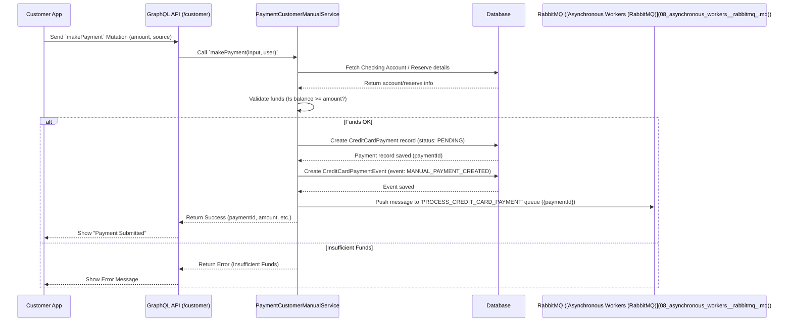
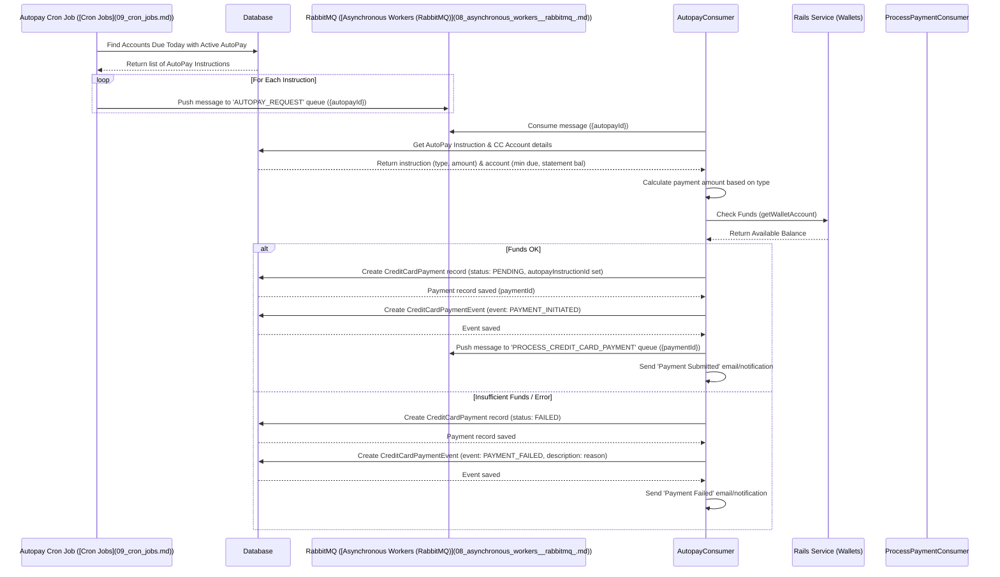
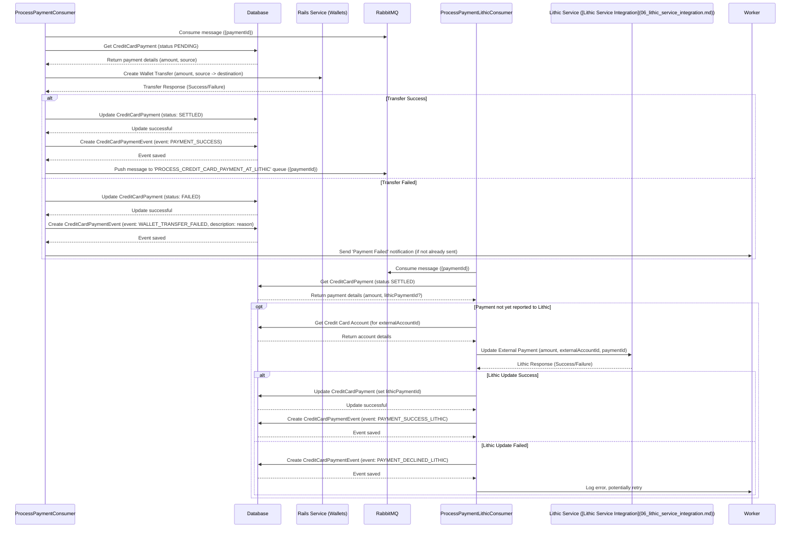

# Chapter 4: Payment Processing (Manual & AutoPay)

In [Chapter 3: Transaction Processing (ASA & Webhooks)](03_transaction_processing__asa___webhooks_.md), we learned how the system handles purchases made with the credit card – approving or declining them in real-time (ASA) and tracking their updates later (Webhooks). But using a credit card means you eventually need to pay the bill!

This chapter explains how users can pay off their credit card balance using the `credit-card-service`.

## Why Do We Need Payment Processing?

Imagine you've used your credit card for various purchases throughout the month. Now, your credit card statement arrives, showing how much you owe and when it's due. You need a way to send money from your bank account to the credit card company to pay off that balance.

Our `credit-card-service` provides the digital equivalent of this. It allows users to:

1.  **Make Manual Payments:** Pay any amount, anytime, from a chosen funding source.
2.  **Set Up AutoPay:** Schedule automatic payments so they don't have to worry about missing a due date.

Think of it like setting up online bill pay for your utilities or phone bill – you can log in and pay manually each month, or you can set up an automatic withdrawal.

## The Two Ways to Pay: Manual vs. AutoPay

Let's look at the two methods users can employ.

### 1. Manual Payments: Paying When You Want

This is like logging into your bank's website and initiating a one-time bill payment.

*   **User Action:** The user decides they want to make a payment *now*. They open the app, go to the payment section.
*   **Choosing the Details:** They select:
    *   **Source:** Where the money comes from (usually their linked checking account, sometimes a specific 'Reserve' or sub-account).
    *   **Amount:** How much they want to pay. This could be the minimum due, the full statement balance, the current balance, or a custom amount.
*   **Submitting:** They confirm the payment.

The system then takes over to process this request.

### 2. AutoPay: Set It and Forget It

This is like setting up a recurring automatic withdrawal for a bill.

*   **User Action:** The user decides they want payments to happen automatically. They go to the AutoPay settings in the app.
*   **Setting the Rules:** They configure:
    *   **Payment Amount Type:** What amount should be paid automatically each month?
        *   Minimum Payment Due
        *   Statement Balance
        *   A Fixed Amount (e.g., $100 every month)
    *   **Funding Source:** Usually their linked checking account.
    *   **Agreement:** They typically need to agree to the terms of automatic payments.
*   **System Action:** Once set up, the system automatically triggers a payment based on these rules on the credit card's payment due date each month.

## How Users Interact: The GraphQL Mutations

As we learned in [Chapter 1: GraphQL API Endpoints](01_graphql_api_endpoints.md), users interact with the service using GraphQL Mutations to perform actions.

### Making a Manual Payment

When a user submits a manual payment through the mobile app, the app sends a `makePayment` Mutation.

*   **Mutation:** `makePayment`
*   **Input (Simplified):**
    *   `amount`: The amount in cents (e.g., `5000` for $50.00).
    *   `paymentOption`: The type chosen (e.g., `MINIMUM_PAYMENT_DUE`, `OTHER`).
    *   `source` (Optional): The ID of the funding source (e.g., a specific Reserve ID, otherwise defaults to the main checking account).
*   **What happens:** The backend service receives this, checks if the user has enough funds in the chosen source, creates a record of the payment attempt, and starts the process of moving the money.

```typescript
// Simplified Input for makePayment Mutation
interface MakePaymentInput {
  amount: number; // e.g., 10050 ($100.50)
  paymentOption: PaymentOptions; // e.g., OTHER, CURRENT_BALANCE
  source?: string; // Optional Reserve ID
}

// Simplified Output
interface MakePaymentOutput {
  operationInfo: { message: string; title: string; }; // e.g., "Payment Submitted"
  paymentId: string; // Internal ID for tracking, e.g., "MCCP-ABC123"
  paidFrom: string; // Description of source, e.g., "Novo Checking 1234"
  paymentDate: string; // e.g., "2023-10-27"
  amount: string; // Formatted amount, e.g., "$100.50"
}
```

### Setting Up AutoPay

When a user configures AutoPay, the app sends a `setupAutoPay` Mutation.

*   **Mutation:** `setupAutoPay`
*   **Input (Simplified):**
    *   `isEnabled`: `true` to turn on AutoPay, `false` to turn it off.
    *   `paymentOption`: Which amount type? (`MINIMUM_PAYMENT_DUE`, `REMAINING_STATEMENT_BALANCE`, `OTHER`).
    *   `amount` (Optional): The fixed amount if `paymentOption` is `OTHER`.
    *   `isAgreementSigned`: `true` if the user accepted the terms.
*   **What happens:** The backend service saves or updates the user's AutoPay preferences (which amount, status active/inactive).

```typescript
// Simplified Input for setupAutoPay Mutation
interface SetupAutoPayInput {
  isEnabled: boolean;
  paymentOption: PaymentOptionsAutoPayEnum; // e.g., MINIMUM_PAYMENT_DUE
  amount?: number; // Only if paymentOption is OTHER
  isAgreementSigned: boolean;
}

// Simplified Output
interface SetupAutoPayOutput {
  operationInfo: { message: string; title: string; }; // e.g., "AutoPay turned on"
}
```

These mutations trigger the backend logic to handle the payment requests.

## How It Works Under the Hood

Making a payment isn't instantaneous. It involves several steps, often happening asynchronously (in the background).

### Manual Payment Flow

Let's trace what happens when a user makes a manual payment:



1.  **API Request:** The app sends the `makePayment` mutation.
2.  **Validation:** The `PaymentCustomerManualService` receives the request. It first validates the input (e.g., is the amount positive?).
3.  **Fund Check:** It checks the specified source (checking account or reserve) to ensure there are enough funds available. This might involve calling another service like `AmsService` or looking up account details from the `AccountRepository`.
4.  **Record Creation:** If funds are sufficient, the service creates two records in the database ([Database Entities & Repositories](07_database_entities___repositories.md)):
    *   A `CreditCardPayment` record: Stores details like amount, user, status (`PENDING`), type (`MANUAL`), source (`reserveId` if applicable).
    *   A `CreditCardPaymentEvent` record: Logs that a manual payment was initiated.
5.  **Queue for Processing:** The service *doesn't* move the money immediately. Instead, it pushes a message containing the `paymentId` onto a RabbitMQ queue named `PROCESS_CREDIT_CARD_PAYMENT`. This delegates the actual money movement to a background worker.
6.  **Response to User:** The service immediately responds to the app, saying the payment has been submitted.

Here's a simplified look at creating the payment record:

```typescript
// File: apps/credit-card-api/src/modules/payment/customer/payment-customer-manual.service.ts (simplified)

private async createPaymentRecord(businessId: string, amount: number, userId: string, creditCardAccountId: string, option: CreditCardPaymentType, reserveId?: string) {
  // ... start database transaction ...
  try {
    const entityManager = /* ... get transaction manager ... */;

    let paymentData: Partial<CreditCardPayment> = {
      amount,
      status: CreditCardPaymentStatus.PENDING, // Starts as PENDING
      businessId,
      userId,
      creditCardAccountId,
      option, // e.g., MINIMUM_DUE, OTHER
      internalId: randomString(6, 'MCCP-'), // User-friendly ID
    };
    if (reserveId) paymentData.reserveId = reserveId; // Note the source if it's a reserve

    // 1. Save the main payment record
    const payment: CreditCardPayment = await this.creditCardPaymentRepository.save(paymentData, entityManager);

    // 2. Save the initial event log
    await this.creditCardPaymentEventRepository.save(
      {
        paymentId: payment.id,
        event: CreditCardPaymentEvents.MANUAL_PAYMENT_CREATED,
        description: `Manual payment of $${Currency.formatCentsToDollars(amount)} created.`,
      },
      entityManager,
    );

    // ... commit database transaction ...
    return payment; // Return the created payment object
  } catch (error) {
    // ... handle error, rollback transaction ...
  }
}
```

### AutoPay Setup Flow

Setting up AutoPay is simpler – it mostly involves saving the user's preferences.

1.  **API Request:** The app sends the `setupAutoPay` mutation.
2.  **Validation:** The `PaymentCustomerAutoService` validates the input (e.g., is `isAgreementSigned` true?).
3.  **Deactivate Old:** If an active AutoPay instruction already exists, it's marked as `INACTIVE`.
4.  **Save New:** If the user is enabling AutoPay (`isEnabled: true`), a new `CreditCardAutoPayInstruction` record is saved in the database with the chosen `type` (MINIMUM_DUE, STATEMENT_BALANCE, FIXED_AMOUNT), `amount` (if fixed), and `status: ACTIVE`.
5.  **Response:** The service confirms the AutoPay settings were updated.

```typescript
// File: apps/credit-card-api/src/modules/payment/customer/payment-customer-auto.service.ts (simplified)

async setupAutoPay(input: SetupAutoPayInput, req: any): Promise<SetupAutoPayOutput> {
    // ... validations (agreement signed, within allowed time window) ...
    const { id: userId, businessId } = req.user;
    const { paymentOption, isEnabled, amount } = input;

    // ... start database transaction ...
    try {
      const entityManager = /* ... get transaction manager ... */;
      const creditCardAccount = /* ... get account ... */;

      // 1. Deactivate any existing active AutoPay instruction
      const existingAutoPay = await this.autoPayInstructionRepository.getOne({ where: { businessId, status: CreditCardPaymentAutoPayStatus.ACTIVE } });
      if (existingAutoPay) {
        await this.autoPayInstructionRepository.update(existingAutoPay.id, { status: CreditCardPaymentAutoPayStatus.INACTIVE }, entityManager);
      }

      // 2. If enabling, save the new instruction
      if (isEnabled) {
        let type: CreditCardPaymentAutoPayInstructionType;
        // ... determine 'type' based on 'paymentOption' input ...

        const dataToSave: Partial<ICreditCardAutoPayInstruction> = {
          type,
          amount, // Will be null unless type is FIXED_AMOUNT
          status: CreditCardPaymentAutoPayStatus.ACTIVE,
          businessId,
          userId,
          creditCardAccountId: creditCardAccount.id,
        };
        await this.autoPayInstructionRepository.save(dataToSave, entityManager);
        // ... set success message 'AutoPay turned on' ...
      } else {
        // ... set success message 'AutoPay turned off' ...
      }

      // ... commit transaction ...
      // ... send confirmation email (using mailerService) ...
      // ... track event with Rudderstack ...

      return { /* ... success response ... */ };
    } catch (error) {
      // ... handle error, rollback transaction ...
    }
}
```

### AutoPay Execution Flow

This happens automatically, triggered by a scheduled task.



1.  **Cron Job:** A scheduled task ([Cron Jobs](09_cron_jobs.md)), `AutopayCron`, runs daily (e.g., just after midnight EST).
2.  **Find Due Accounts:** It queries the database (`CreditCardAccountRepository`) to find all accounts where the `paymentDueDate` is today AND there's an active `CreditCardAutoPayInstruction`.
3.  **Queue Requests:** For each matching account, the cron job pushes a message with the `autopayId` to the `AUTOPAY_REQUEST` RabbitMQ queue.
4.  **AutoPay Worker:** An `AutopayConsumer` worker picks up messages from the `AUTOPAY_REQUEST` queue.
5.  **Calculate Amount:** It retrieves the full AutoPay instruction and the current credit card account details (minimum due, statement balance). It calculates the exact payment amount based on the instruction's `type`.
6.  **Check Funds:** It checks the user's checking account balance, often by calling an external service like the Rails wallet system (`RailsService.getWalletAccount`).
7.  **Create Payment or Fail:**
    *   **If Funds OK:** It creates the `CreditCardPayment` (status `PENDING`, linking the `autopayInstructionId`) and `CreditCardPaymentEvent` records, similar to a manual payment. It then pushes a message to the *same* `PROCESS_CREDIT_CARD_PAYMENT` queue used by manual payments. It also sends notifications (email, push) that the AutoPay payment was submitted.
    *   **If Insufficient Funds / Error:** It creates a `CreditCardPayment` record with status `FAILED` and a `CreditCardPaymentEvent` explaining the failure reason. It sends notifications that the AutoPay payment failed.

```typescript
// File: apps/credit-card-cron-jobs/src/modules/payment/autopay.cron.ts (simplified)

@Cron(/* ... schedule ... */)
private async run() {
  // ... get current date ...
  // 1. Find accounts due today with active autopay
  const accountsDue = await this.creditCardAccountRepository.fetchAutoPayDuePayment(todayDate);

  // 2. Queue a job for each one
  for (const { id: autopayId } of accountsDue) {
    const eventPayload: IAutopayEvent = { autopayId, /* ... other details ... */ };
    this.mqProducerService.pushMessage(RABBITMQ.QUEUES.AUTOPAY_REQUEST, eventPayload);
  }
}

// File: apps/credit-card-workers/src/modules/payment/autopay/autopay.consumer.ts (simplified)

async handle(message: IAutopayEvent): Promise<any> {
  const { autopayId } = message;
  // 1. Get instruction and account details from DB
  const autopay = await this.autoPayInstructionRepository.getById(autopayId);
  const ccAccount = await this.creditCardAccountRepository.getOne({ where: { id: autopay.creditCardAccountId } });

  // 2. Calculate payment amount based on autopay.type and ccAccount details
  let amount = /* ... calculate amount ... */;
  let option = /* ... determine payment type ... */

  // ... handle cases like zero amount, amount > limit ...

  // 3. Check funds via Rails service
  const walletAccountResp = await this.railsService.getWalletAccount(/* ... */);
  const availableBalance = Currency.formatDollarsToCents(walletAccountResp.data.balance.availableBalance);

  if (availableBalance < amount) {
    // 4a. Handle insufficient funds: create FAILED payment record & event, notify user
    await this.insertFailedPayment(/* ... reason: 'Insufficient balance' ... */);
    // ... send failure notification ...
    return { status: 'failed' };
  }

  // ... check account status, restrictions ...

  // 4b. Handle funds OK: create PENDING payment record & event
  const paymentInDB = await this.paymentRepository.save({
      amount, status: CreditCardPaymentStatus.PENDING, /* ... other details ... */, autopayInstructionId: autopay.id
  }, /* ... db transaction ... */);
  await this.paymentEventRepository.save({ event: CreditCardPaymentEvents.PAYMENT_INITIATED }, /* ... */);

  // 5. Push to next queue for actual processing
  await this.mqProducerService.pushMessage(RABBITMQ.QUEUES.PROCESS_CREDIT_CARD_PAYMENT, { paymentId: paymentInDB.id, retryCount: 0 });

  // 6. Notify user payment was submitted
  await this.mailerHelper.paymentSubmitted(/* ... */);
  return { status: 'processed' };
}
```

### Processing the Payment (Moving Money)

Whether initiated manually or via AutoPay, the payment ends up as a message in the `PROCESS_CREDIT_CARD_PAYMENT` queue. What happens next?



1.  **Process Payment Worker:** A `ProcessPaymentConsumer` picks up the message.
2.  **Fetch Payment:** It retrieves the `CreditCardPayment` record (which should be `PENDING`).
3.  **Wallet Transfer:** It calls the Rails wallet service (`RailsService.createWalletTransfer`) to initiate the actual movement of funds from the user's checking account (or reserve) to the appropriate internal account representing credit card payments.
4.  **Update Status (DB):**
    *   **If Transfer Succeeds:** The worker updates the `CreditCardPayment` status to `SETTLED` and logs a `PAYMENT_SUCCESS` event.
    *   **If Transfer Fails:** It updates the status to `FAILED` and logs a `WALLET_TRANSFER_FAILED` event with the reason.
5.  **Notify Lithic (Queue):** If the transfer was successful, the worker pushes *another* message to the `PROCESS_CREDIT_CARD_PAYMENT_AT_LITHIC` queue.
6.  **Process Lithic Worker:** A `ProcessPaymentLithicConsumer` picks up this message.
7.  **Inform Lithic:** This worker calls the Lithic API ([Lithic Service Integration](06_lithic_service_integration.md)) via `LithicService.updateExternalPayment`. This tells Lithic that a payment has been successfully received for the credit card account. Lithic uses this information to update the user's available credit limit.
8.  **Update Lithic ID (DB):** If informing Lithic succeeds, the worker updates the `CreditCardPayment` record to store Lithic's confirmation ID (`lithicPaymentId`) and logs a `PAYMENT_SUCCESS_LITHIC` event. If it fails, it logs a `PAYMENT_DECLINED_LITHIC` event.

```typescript
// File: apps/credit-card-workers/src/modules/payment/process-payment/process-payment.consumer.ts (simplified)

async handle(message: IMakePaymentEvent): Promise<IConsumerResponse> {
  const { paymentId } = message;
  // 1. Get payment details (expecting PENDING status)
  const payment = await this.paymentRepository.getById(paymentId);
  // ... check if payment exists and status is PENDING ...

  // 2. Get source account details
  const account = await this.accountRepository.getOne({ where: { businessId: payment.businessId } });
  // ... check account status ...

  // 3. Attempt wallet transfer via Rails Service
  const walletResp = await this.railsService.createWalletTransfer({
      // ... details: amount, account number, paymentId as refId ...
  });

  if (!walletResp || walletResp.hasError) {
    // 4a. Handle Transfer Failure: Update DB to FAILED, log event
    await this.paymentRepository.update(payment.id, { status: CreditCardPaymentStatus.FAILED });
    await this.paymentEventRepository.save({ event: CreditCardPaymentEvents.WALLET_TRANSFER_FAILED });
    // ... maybe requeue or notify ...
    return { status: 'failed' };
  }

  // 4b. Handle Transfer Success: Update DB to SETTLED, log event
  await this.paymentRepository.update(payment.id, { status: CreditCardPaymentStatus.SETTLED });
  await this.paymentEventRepository.save({ event: CreditCardPaymentEvents.PAYMENT_SUCCESS });

  // 5. Queue job to notify Lithic
  await this.mqProducerService.pushMessage(RABBITMQ.QUEUES.PROCESS_CREDIT_CARD_PAYMENT_AT_LITHIC, { paymentId });

  // ... potentially trigger account balance sync via Kafka ...
  return { status: 'processed' };
}

// File: apps/credit-card-workers/src/modules/payment/process-payment-lithic/process-payment-lithic.consumer.ts (simplified)

async handle(message: IPaymentProcessLithicEvent): Promise<IConsumerResponse> {
  const { paymentId } = message;
  // 1. Get payment details (expecting SETTLED status)
  const payment = await this.paymentRepository.getById(paymentId);
  // ... check if payment exists, is SETTLED, and lithicPaymentId is not already set ...

  // 2. Get Lithic account token
  const ccAccount = await this.creditCardAccountRepository.getById(payment.creditCardAccountId);

  // 3. Call Lithic API to report the external payment
  const lithicExternalPaymentResp = await this.lithicService.updateExternalPayment({
      amount: payment.amount,
      financial_account_token: ccAccount.externalAccountId, // Lithic's ID for the CC account
      token: payment.id, // Use our payment ID as Lithic's idempotency token
      // ... other required fields like effective date, type ...
  });

  if (lithicExternalPaymentResp.hasError || /* ... check result code ... */ ) {
    // 4a. Handle Lithic Failure: Log event, maybe retry
    await this.paymentEventRepository.save({ event: CreditCardPaymentEvents.PAYMENT_DECLINED_LITHIC });
    return { status: 'error' };
  }

  // 4b. Handle Lithic Success: Update DB with lithicPaymentId, log event
  await this.paymentRepository.update(payment.id, { lithicPaymentId: lithicExternalPaymentResp.success.token });
  await this.paymentEventRepository.save({ event: CreditCardPaymentEvents.PAYMENT_SUCCESS_LITHIC });

  // ... Send success events to Rudderstack ...
  return { status: 'processed' };
}
```

This multi-step, asynchronous process ensures payments are handled reliably, even if moving money or contacting external partners takes time.

## Key Database Entities

The payment process revolves around these main database tables ([Database Entities & Repositories](07_database_entities___repositories.md)):

*   **`credit_card_payments`:** Stores the core details of each payment attempt (manual or auto). Tracks amount, status (`PENDING`, `SETTLED`, `FAILED`), user, source (`reserveId`), type (`option`), and links to AutoPay instructions (`autopayInstructionId`) and Lithic confirmations (`lithicPaymentId`).
*   **`credit_card_payment_events`:** A log table keeping track of the history of each payment (created, initiated, success, failed, reason, Lithic update status).
*   **`credit_card_autopay_instructions`:** Stores the user's active or inactive AutoPay settings (type, amount, status).

## Conclusion

You've now seen how the `credit-card-service` enables users to pay their credit card bills, either manually or automatically via AutoPay. We learned that:

*   Users trigger payments via GraphQL Mutations (`makePayment`, `setupAutoPay`).
*   Manual payments involve selecting a source and amount.
*   AutoPay involves setting rules (amount type) that run automatically on the due date, triggered by a [Cron Job](09_cron_jobs.md).
*   The actual processing is asynchronous, using [RabbitMQ Workers](08_asynchronous_workers__rabbitmq_.md) to:
    *   Check funds.
    *   Create initial payment records (`PENDING`).
    *   Interact with wallet systems (like Rails) to move money (`SETTLED` or `FAILED`).
    *   Notify the card issuer ([Lithic Service Integration](06_lithic_service_integration.md)) about successful payments.
*   Key database entities (`CreditCardPayment`, `CreditCardPaymentEvent`, `CreditCardAutoPayInstruction`) track the state and history of payments.

Understanding payments is crucial, but sometimes things go wrong with the original purchases. What happens if a user doesn't recognize a charge or received faulty goods?

**Next:** [Dispute Management](05_dispute_management.md)

---

Generated by [AI Codebase Knowledge Builder](https://github.com/The-Pocket/Tutorial-Codebase-Knowledge)