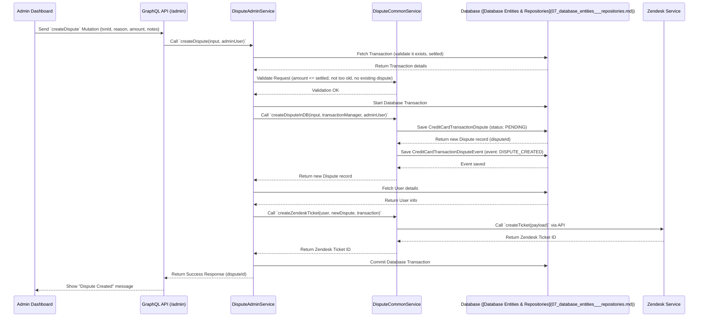

# Chapter 5: Dispute Management

In [Chapter 4: Payment Processing (Manual & AutoPay)](04_payment_processing__manual___autopay_.md), we saw how customers pay their credit card bills. But what happens if a customer looks at their statement and sees a charge they don't recognize, or if they paid for something that never arrived? That's where Dispute Management comes in.

## What's a Dispute? Why Do We Need to Manage It?

Imagine you check your grocery receipt and find you were charged for an item you didn't buy. You'd go back to the store's customer service desk to "dispute" the charge, show your receipt, explain the problem, and hopefully get your money back.

A credit card dispute is very similar, but for transactions on your statement. It's the formal process for challenging a charge. Maybe:

*   You don't recognize the transaction at all.
*   You were charged the wrong amount.
*   You paid for something but never received it.
*   You returned an item, but the credit never appeared on your statement.

Simply calling customer support isn't enough for the bank to reverse the charge. There's a formal process involving evidence, communication with the merchant and the card network (like Visa/Mastercard), and tracking until a final decision is made.

Our `credit-card-service` needs to handle this entire **Dispute Lifecycle**: from the moment a user flags a problem to the final resolution.

**Use Case:** A customer sees a $50 charge on their statement from "SuperStore Online" but they don't remember buying anything there. They want to challenge this charge.

## The Dispute Lifecycle: From Start to Finish

Managing a dispute involves several key stages:

1.  **Initiation:** Starting the dispute process.
2.  **Information Gathering:** Collecting details and evidence.
3.  **Submission:** Sending the dispute to the card issuer (our partner, Lithic).
4.  **Tracking:** Monitoring updates from the issuer.
5.  **Resolution:** Handling the final outcome (charge reversed or upheld).

Let's look at each stage.

### 1. Initiation: Raising the Red Flag

A dispute can be started in two main ways:

*   **By the Customer:** Using their mobile app, they find the problematic transaction and tap a "Dispute this charge" button.
*   **By an Admin:** An internal support agent, perhaps after talking to the customer, uses the admin dashboard to start the dispute process for a specific transaction.

**How it happens:**

*   The app or dashboard sends a `createDispute` **Mutation** via the [GraphQL API Endpoints](01_graphql_api_endpoints.md).
*   This mutation includes details like:
    *   Which transaction is being disputed (`creditCardTransactionId`).
    *   The reason for the dispute (e.g., `TRANSACTION_NOT_RECOGNIZED`, `MERCHANDISE_OR_SERVICE_NOT_RECEIVED`).
    *   The amount being disputed (sometimes the full amount, sometimes partial).
    *   Any initial notes from the customer or admin.

```typescript
// Simplified Input DTO for creating a dispute via Admin API
// File: apps/credit-card-api/src/modules/dispute/dto/create-dispute-admin.input.ts (simplified)
export class CreateDisputeAdminInput {
  creditCardTransactionId: string; // Which transaction?
  reason: TransactionDisputeReason; // Why dispute? (e.g., NOT_RECOGNIZED)
  amount: number; // Amount in dollars (e.g., 50.00)
  customerNote?: string; // Notes from the customer
  internalNote?: string; // Notes for internal team
}
```

This input tells the service which transaction is being questioned and why.

### 2. Information Gathering: Building the Case

Just like going to the customer service desk, you need details. The service needs to collect information to support the dispute.

*   **Details:** Confirming the transaction, user, amount, reason.
*   **Notes:** Capturing the customer's explanation and any notes from the admin investigating the issue.
*   **Evidence (Optional but helpful):** Users or admins might upload supporting documents like:
    *   Receipts showing the correct amount.
    *   Email confirmations of cancellation.
    *   Photos of incorrect items received.
    *   Proof of return shipping.

**How it happens:**

*   Admins can update the dispute details (notes, potentially the reason or amount if initially incorrect) using an `updateDispute` mutation.
*   Admins (and sometimes customers) can upload evidence files using an `uploadEvidence` mutation.
*   The service saves these notes and links to the evidence files in our database, associated with the specific dispute record. ([Database Entities & Repositories](07_database_entities___repositories.md))

```typescript
// Simplified DTO for uploading evidence via Admin API
// File: apps/credit-card-api/src/modules/dispute/dto/admin-upload-evidence.input.ts (simplified)
export class AdminUploadEvidenceInputDto {
  disputeId: string; // Which dispute does this belong to?
  localFile: Promise<FileUpload>; // The actual file being uploaded
}

// Simplified Output after uploading
export class AdminUploadEvidenceOutputDto {
  evidenceId: string; // The ID of the saved evidence record
  operationInfo: { title: string; message: string; };
}
```

### 3. Support Ticket (Optional): Internal Tracking

For complex cases or just for internal tracking, initiating a dispute can automatically create a support ticket in a system like Zendesk.

**How it happens:**

*   When a dispute is created, the `DisputeCommonService` calls the `ZendeskService`.
*   The `ZendeskService` uses the Zendesk API to create a new ticket, linking it back to our internal dispute ID.
*   This allows support agents to manage communication and track the case status within Zendesk, alongside our internal system.

```typescript
// Simplified code snippet from DisputeCommonService
// File: apps/credit-card-api/src/modules/dispute/common/dispute.common.service.ts (simplified)

async createZendeskTicket(user: User, dispute: CreditCardTransactionDispute, ccTxn: CreditCardTransaction): Promise<string> {
  // ... gather user name, dispute details, admin page URL ...
  const ticketTags = this.getCreateZendeskTicketTags(/* ... */);
  const ticketDescriptionHTML = this.getTransactionDisputeTicketDescHTML(/* ... */);

  const zendeskPayload = {
    ticket: {
      // ... externalId, subject, requesterId ...
      tags: ticketTags,
      comment: { html_body: ticketDescriptionHTML, public: false },
      // ... other Zendesk fields ...
    },
  };

  // Call the Zendesk service to create the ticket via API
  const zendeskTicketId = await this.zendeskService.createTicket(zendeskPayload);

  // Update our dispute record with the Zendesk ticket ID (done elsewhere)
  // await this.disputeRepository.update(dispute.id, { zendeskTicketId });

  return zendeskTicketId;
}
```
This function prepares the necessary information and asks the dedicated `ZendeskService` to create the ticket.

### 4. Submission to Issuer: Making it Official

Once the internal team has reviewed the details and gathered necessary information, they formally submit the dispute to the actual card issuer – in our case, Lithic. This starts the clock on the official chargeback process with the merchant and card network.

**How it happens:**

*   An admin uses the dashboard to trigger the submission, sending a `submitDisputeToIssuer` mutation.
*   The `DisputeAdminService` takes the dispute details (amount, reason, notes) and calls the `LithicService` ([Lithic Service Integration](06_lithic_service_integration.md)).
*   The `LithicService` communicates with the Lithic API to create the dispute on their platform.
*   Lithic returns a unique ID for *their* dispute record.
*   Our service updates the internal dispute record's status (e.g., to `UPLOADED`) and saves Lithic's dispute ID (`externalTransactionDisputeId`).

```typescript
// Simplified code snippet from DisputeAdminService
// File: apps/credit-card-api/src/modules/dispute/admin/dispute.admin.service.ts (simplified)

async submitDisputeToIssuer(dispute: CreditCardTransactionDispute, externalTransactionId: string, adminUser: RequestedAdminUser): Promise<boolean> {
  // ... start DB transaction ...
  try {
    // 1. Prepare payload for Lithic API
    const lithicPayload: Lithic.DisputeCreateParams = {
      amount: dispute.amount, // Amount in cents
      reason: dispute.externalReason, // Specific reason code for Lithic
      transaction_token: externalTransactionId, // Lithic's ID for the original transaction
      customer_note: /* ... combine notes ... */,
    };

    // 2. Call Lithic Service to initiate the dispute via API
    const lithicResponse = await this.lithicService.initiateDispute(lithicPayload);

    // 3. Update our database: status -> UPLOADED, store Lithic's dispute ID
    await this.disputeRepository.update(dispute.id, {
        status: TransactionDisputeStatus.UPLOADED,
        externalTransactionDisputeId: lithicResponse.token // Save Lithic's ID
    }, /* ... transaction manager ... */);

    // 4. Log the event in our dispute events table
    await this.disputeEventRepository.save({
        /* ... event details: DISPUTE_UPLOADED ... */
    }, /* ... transaction manager ... */);

    // ... commit DB transaction ...
    this.loggerService.info('SUBMIT_DISPUTE_TO_ISSUER', 'Dispute submitted', { externalDisputeId: lithicResponse.token });
    return true;
  } catch (error) {
    // ... handle error, rollback transaction ...
    return false;
  }
}
```
This function orchestrates talking to Lithic and updating our own records to reflect that the dispute is now officially filed with the issuer.

### 5. Tracking Status via Webhooks: Waiting for Updates

Once submitted to Lithic, the dispute enters the chargeback system. The merchant gets a chance to respond, and the card network makes decisions. This can take weeks or even months. Lithic receives updates during this process and tells our system about them using **Webhooks**.

**Analogy:** You've filed your complaint at the store's head office (Lithic). Now you wait for mail updates on their investigation.

**How it happens:**

*   Events occur in the chargeback process (e.g., merchant responds, Lithic requests more info, a decision is made).
*   Lithic sends a webhook event (like `dispute.updated`) to a specific endpoint in our system. (See [Transaction Processing (ASA & Webhooks)](03_transaction_processing__asa___webhooks_.md) for the webhook concept).
*   This endpoint quickly queues the webhook data for background processing ([Asynchronous Workers (RabbitMQ)](08_asynchronous_workers__rabbitmq_.md)).
*   A worker (like `DisputeUpdatedConsumer`) picks up the message.
*   It finds the corresponding internal dispute record using the IDs in the webhook payload.
*   It updates our database based on the webhook data:
    *   Creates or updates the `CreditCardExternalTransactionDispute` record (representing Lithic's view of the dispute).
    *   Might update the status of our primary `CreditCardTransactionDispute`.
    *   Logs the event (e.g., `EXTERNAL_DISPUTE_STATUS_CHANGED`).
    *   Might update the associated Zendesk ticket.

```typescript
// Simplified code snippet from the worker handling dispute updates from Lithic
// File: apps/credit-card-workers/src/modules/dispute/dispute-updated/dispute-updated.consumer.ts (simplified)

async handle(payload: DisputeUpdatedEvent): Promise<{ status: string; message: string }> {
  // ... start DB transaction ...
  try {
    // 1. Find our internal dispute record based on the transaction token in the payload
    const internalDispute = await this.transactionDisputeRepository.findOne({ /* ... where transaction matches ... */ });
    if (!internalDispute) { /* ... handle error ... */ }

    // 2. Find or create the record representing Lithic's dispute view
    let externalDispute = await this.externalTransactionDisputeRepository.findOne({ where: { externalId: payload.token } });

    if (externalDispute) {
      // 3a. Update existing external dispute record
      await this.externalTransactionDisputeRepository.update(externalDispute.id, {
        status: payload.status, // Update status from webhook
        reason: payload.reason,
        resolutionReason: payload.resolution_reason,
        // ... update other fields based on payload ...
      }, /* ... transaction manager ... */);
      // Log the event
      await this.externalTransactionDisputeEventRepository.save({ /* ... event details ... */ });

    } else {
      // 3b. Create a new external dispute record (e.g., if Lithic split the dispute)
      externalDispute = await this.externalTransactionDisputeRepository.save({
        id: randomUUID(),
        externalId: payload.token, // Lithic's ID
        status: payload.status,
        // ... other fields from payload ...
        creditCardTransactionDisputeId: internalDispute.id, // Link to our dispute
      }, /* ... transaction manager ... */);
       // Log the event
      await this.externalTransactionDisputeEventRepository.save({ /* ... event details ... */ });
    }

    // ... commit DB transaction ...

    // 4. Update the associated Zendesk ticket with the new status
    await this.updateZendeskTicket(internalDispute, externalDispute);

    return { status: 'processed', message: 'Dispute Updated' };
  } catch (error) {
    // ... handle error, rollback transaction ...
  }
}
```
This worker acts on the notifications from Lithic, keeping our system's view of the dispute in sync with the official process.

### 6. Provisional Credit (Sometimes): Temporary Relief

Sometimes, especially for "unauthorized transaction" disputes, the bank might issue a **Provisional Credit** (PC).

**Analogy:** The grocery store might give you a temporary refund for the disputed item while they investigate further with the supplier. If they later find you *did* buy it, they might reverse that credit.

**How it happens:**

*   An admin, based on policy (e.g., dispute submitted to Lithic, reason is unauthorized), decides to issue PC. They trigger an `issueProvisionalCredit` mutation.
*   The service calls `LithicService` to create a special "management transaction" via the Lithic API, crediting the disputed amount back to the customer's account *temporarily*.
*   A record of this management transaction (`CreditCardManagementTransaction`) is saved in our database, linked to the dispute.
*   Crucially, this credit might be reversed later depending on the final dispute outcome.

```typescript
// Simplified code snippet from DisputeAdminService for issuing PC
// File: apps/credit-card-api/src/modules/dispute/admin/dispute.admin.service.ts (simplified)

async issueProvisionalCredit(data: IssueProvisionalCreditInput, adminUser: RequestedAdminUser) {
  // ... validate dispute status, permissions, check if PC already issued ...
  try {
    // ... find dispute, account, transaction details ...
    const transactionDate = /* ... get original transaction date ... */;
    const account = /* ... get credit card account ... */;

    // 1. Create management transaction record in our DB (status PENDING initially)
    const managementTxn = await this.creditCardManagementTransactionRepository.save({
      /* ... details: amount, disputeId, status=PENDING, type=CREDIT, eventType=PROVISIONAL_CREDIT ... */
    });

    // 2. Call Lithic API to create the management operation (credit)
    await this.lithicService.createManagementOperation({
      category: 'MANAGEMENT_DISPUTE',
      event_type: 'PROVISIONAL_CREDIT',
      financial_account_token: account.externalAccountId,
      amount: managementTxn.amount,
      user_defined_id: disputeId, // Link to our dispute
      effective_date: transactionDate,
      token: managementTxn.externalTransactionId, // Our ID for idempotency
      direction: 'CREDIT',
      memo: 'Provisional Credit',
    });

    // 3. Update dispute record: mark PC as issued (may be updated by webhook later)
    await this.disputeRepository.update(disputeId, { disputeAmountCredited: true, approvedDisputeAmount: managementTxn.amount });
    // 4. Log the event
    await this.disputeEventRepository.save({ event: TransactionDisputeEvent.PROVISIONAL_CREDIT_ISSUED });

    return { /* ... success response ... */ };
  } catch (error) {
    // ... handle error (Lithic call might fail, need retry logic) ...
  }
}
```

### 7. Resolution: The Final Decision

Eventually, Lithic informs us of the final outcome via a webhook (`dispute.updated` with a terminal status like `CASE_WON`, `CASE_LOST`, `ACCEPTED`, `REJECTED`).

**How it happens:**

*   The `DisputeUpdatedConsumer` (or similar) processes the final status webhook from Lithic.
*   An admin reviews the final status (or sometimes the system handles it automatically based on rules). An admin might use a `resolveDispute` mutation.
*   The service updates the main `CreditCardTransactionDispute` status to a final state (e.g., `ACCEPTED`, `REJECTED`, `PARTIALLY_ACCEPTED`).
*   **Provisional Credit Handling:**
    *   If the dispute was **won** (or accepted): The provisional credit (if issued) becomes permanent. No change needed if already credited. If PC wasn't issued, a final credit might be applied now.
    *   If the dispute was **lost** (or rejected): Any provisional credit issued must be **reversed**. The service calls `LithicService.reverseManagementOperation` to debit the amount back from the customer's account.
*   The customer is notified of the final outcome via email/app notification.
*   The Zendesk ticket is marked as solved.

```typescript
// Simplified internal logic when resolving a dispute (part of DisputeAdminService.resolveDispute)

// 1. Determine final status (e.g., ACCEPTED, REJECTED) based on Lithic webhook / admin input

// 2. Check if Provisional Credit (PC) exists for this dispute
const lastPC = await this.creditCardManagementTransactionRepository.getLatestPCTxnByDisputeId(disputeInfo.id);

if (finalStatus === 'ACCEPTED' || finalStatus === 'PARTIALLY_ACCEPTED') {
  // Dispute Won (fully or partially) - Make PC permanent or issue final credit
  const amountToCredit = /* ... calculate final credited amount ... */;
  if (lastPC && lastPC.status === 'SETTLED') {
    // PC already issued and settled, ensure amount matches final decision
    if (lastPC.amount !== amountToCredit) {
       // Reverse old PC, issue new one for correct amount (complex case)
       await this.lithicService.reverseManagementOperation(lastPC.externalTransactionId, /* ... */);
       await this.issueFinalCredit(disputeInfo, amountToCredit);
    } // else: PC amount was correct, do nothing.
  } else if (!lastPC || lastPC.status !== 'SETTLED') {
    // No PC, or pending PC. Issue final credit now.
    await this.issueFinalCredit(disputeInfo, amountToCredit);
  }
  // Update dispute record with final credited amount
  await this.disputeRepository.update(disputeInfo.id, { status: finalStatus, approvedDisputeAmount: amountToCredit, disputeAmountCredited: true });

} else { // finalStatus === 'REJECTED'
  // Dispute Lost - Reverse any PC
  if (lastPC && lastPC.status === 'SETTLED') {
    // PC was issued and settled, reverse it now
    await this.lithicService.reverseManagementOperation(lastPC.externalTransactionId, { memo: 'Reversing Provisional Credit - Dispute Lost' });
    // Lithic webhook will eventually update the management Txn status to REVERSED
  } else if (lastPC && lastPC.status === 'PENDING') {
    // Cancel the pending PC before it settles
    await this.creditCardManagementTransactionRepository.update(lastPC.id, { status: 'CANCELED' });
  }
  // Update dispute record: status REJECTED, amount credited = 0
  await this.disputeRepository.update(disputeInfo.id, { status: finalStatus, approvedDisputeAmount: 0, disputeAmountCredited: false });
}

// 3. Log the resolution event
await this.disputeEventRepository.save({ event: TransactionDisputeEvent.DISPUTE_UPDATED, description: `Dispute resolved as ${finalStatus}` });

// 4. Notify the customer
await this.sendResolutionEmail(disputeInfo, finalStatus, /* ... */);

// 5. Update Zendesk ticket
await this.zendeskService.updateTicket(disputeInfo.zendeskTicketId, { status: 'solved' });
```
This complex logic ensures the final financial state matches the dispute outcome, especially handling the reversal of provisional credits correctly.

## Internal Flow: Creating a Dispute (Simplified)

Let's trace how an admin initiating a dispute flows through the system:



1.  **Admin Action:** Admin submits the form on the dashboard.
2.  **API Call:** The dashboard sends a `createDispute` GraphQL Mutation to the `/admin` endpoint.
3.  **Validation:** The `DisputeAdminService` receives the request and uses `DisputeCommonService` to validate the transaction and the request details.
4.  **Database Transaction:** A database transaction is started to ensure all database changes happen together or not at all.
5.  **Create Dispute Record:** `DisputeCommonService.createDisputeInDB` saves the main `CreditCardTransactionDispute` record with status `PENDING` and logs a `DISPUTE_CREATED` event in the `CreditCardTransactionDisputeEvent` table.
6.  **Create Zendesk Ticket:** The service calls `DisputeCommonService.createZendeskTicket`, which prepares data and calls the `ZendeskService` to create a ticket via the Zendesk API.
7.  **Commit Transaction:** If all steps succeed, the database transaction is committed.
8.  **Response:** A success message is returned to the admin dashboard.

## Key Database Entities

This process heavily relies on several database tables ([Database Entities & Repositories](07_database_entities___repositories.md)):

*   **`credit_card_transaction_disputes`:** The main table tracking *our* internal record of the dispute. Stores status, reason, amount, notes, links to user/transaction, and the `zendeskTicketId` and `externalTransactionDisputeId` (Lithic's ID).
*   **`credit_card_transaction_dispute_events`:** Logs every significant action related to our internal dispute (Created, Updated, Evidence Added, PC Issued, Resolved, Contacted User).
*   **`credit_card_transaction_dispute_evidences`:** Stores metadata about uploaded evidence files, linking to the actual file stored elsewhere (like S3) via `credit_card_documents`. Tracks evidence status (Uploaded to Lithic, Deleted).
*   **`credit_card_documents`:** Stores information about uploaded files (S3 key, filename, MIME type), linked from the evidence table.
*   **`credit_card_external_transaction_disputes`:** Stores information received from Lithic about *their* view of the dispute(s) associated with our internal one. Tracks Lithic's status, reason codes, resolution details. Updated primarily via webhooks.
*   **`credit_card_management_transactions`:** Tracks special transactions like Provisional Credits, including their status (Pending, Settled, Reversed) and link back to the dispute.

## Conclusion

You've now learned how the `credit-card-service` manages the complex lifecycle of a transaction dispute. We covered:

*   **Initiation:** Starting a dispute via customer app or admin dashboard (`createDispute`).
*   **Information Gathering:** Adding notes and evidence (`updateDispute`, `uploadEvidence`).
*   **Issuer Submission:** Formally filing the dispute with Lithic (`submitDisputeToIssuer`).
*   **Tracking:** Receiving status updates from Lithic via webhooks (`DisputeUpdatedConsumer`).
*   **Provisional Credit:** Issuing temporary credits during investigation (`issueProvisionalCredit`).
*   **Resolution:** Handling the final outcome, including reversing provisional credit if needed (`resolveDispute`).
*   **Key Services:** Interactions with `LithicService`, `ZendeskService`, `S3Service`.
*   **Database:** Storing dispute state and history in dedicated tables.

This process ensures that customer issues with transactions are handled formally, tracked accurately, and resolved according to defined procedures and external partner interactions.

Understanding how we interact with our main partner, Lithic, is crucial for many parts of the service. Let's dive deeper into that integration next.

**Next:** [Lithic Service Integration](06_lithic_service_integration.md)

---

Generated by [AI Codebase Knowledge Builder](https://github.com/The-Pocket/Tutorial-Codebase-Knowledge)