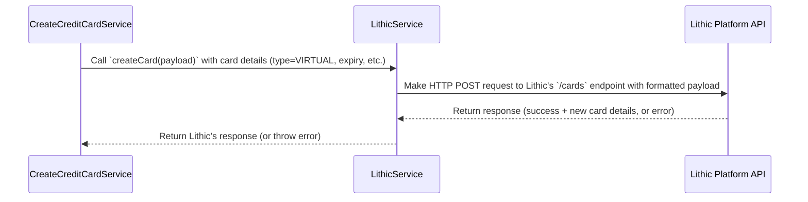

# Chapter 6: Lithic Service Integration

In the previous chapter on [Dispute Management](05_dispute_management.md), we saw how our service interacts with an external partner (Lithic) to handle chargebacks. This interaction isn't unique to disputes; almost every critical function of a credit card – creating it, using it, paying it – involves talking to the company that actually issues the card.

This chapter introduces the crucial component that manages all this communication: the **Lithic Service Integration**.

## Why Do We Need an External Partner (Lithic)?

Think about starting a new airline. You could build your own planes, train your own pilots, get all the safety certifications worldwide... or you could partner with an existing aircraft manufacturer (like Boeing or Airbus) and lease certified planes.

Similarly, issuing official credit cards that work on global networks like Visa or Mastercard is incredibly complex. It involves strict regulations, security protocols, and connections to the financial system. Instead of building all that infrastructure ourselves, our `credit-card-service` partners with a specialized company called **Lithic**.

**Lithic is our card issuer.** They handle:

*   Creating the actual card account numbers.
*   Manufacturing and shipping physical cards.
*   Connecting to Visa/Mastercard to process transactions.
*   Managing the core ledger for card balances and limits.
*   Providing APIs so our `credit-card-service` can *tell* Lithic what to do (like create a card, approve a transaction, or process a payment).

## The `LithicService`: Our Direct Phone Line

Imagine Lithic is the big operations center for the credit card company. If different parts of our `credit-card-service` (like card creation, transaction processing, payments) all needed to talk to Lithic directly, it could get messy. Everyone might use slightly different language, handle errors differently, or need the same secret phone number (API key).

To keep things organized and consistent, we have a dedicated service within our codebase called `LithicService`.

**Analogy:** Instead of everyone in our company having the direct number to the operations center, we have one official operator (`LithicService`). Any part of our system that needs something from Lithic goes through this operator. The operator knows exactly how to phrase the request, handles busy signals (errors), and uses the official secure line (API key).

The `LithicService` acts as an **adapter** or **translator**. It provides simple functions for our internal services to use (like `createCard`, `updateCard`, `closeCard`) and translates those requests into the specific API calls that Lithic understands.

You can find the main logic for this service here:

*   `libs/lithic/src/lithic.service.ts`

## What Does the `LithicService` Do?

The `LithicService` is responsible for making *outbound* calls to the Lithic API to perform various actions. Almost every major feature we've discussed relies on it:

1.  **Card Lifecycle Management ([Card Management Lifecycle](02_card_management_lifecycle.md)):**
    *   `createCard`: Tells Lithic to generate a new virtual or physical card.
    *   `updateCard`: Tells Lithic to change a card's status (e.g., `OPEN` to `PAUSED` for freezing, or `PAUSED` to `OPEN` for unfreezing).
    *   `closeCard`: Tells Lithic to permanently deactivate a card.
    *   `reissuePhysicalCard`: Tells Lithic to create a replacement for a lost/stolen/damaged physical card.

2.  **Retrieving Card Information:**
    *   `getCard`: Asks Lithic for the current details of a specific card (needed to check status, etc.).
    *   `getEmbedCardURL`: Asks Lithic for a secure URL to display sensitive card details (like the full card number) in the user's app.

3.  **Payment Processing ([Payment Processing (Manual & AutoPay)](04_payment_processing__manual___autopay_.md)):**
    *   `updateExternalPayment`: Tells Lithic that we have received a payment from the customer, so Lithic can update the account balance and available credit on their end.

4.  **Dispute Management ([Dispute Management](05_dispute_management.md)):**
    *   `initiateDispute`: Tells Lithic to start the formal chargeback process for a transaction.
    *   `createManagementOperation`: Tells Lithic to issue a provisional credit (or reverse one).
    *   `initiateEvidenceUpload`: Tells Lithic we have evidence to upload for a dispute case.

5.  **Fetching Data:**
    *   `getSettlementReportSummary`, `getSettlementReportItems`: Fetches reports about settled transactions.
    *   `getStatement`, `getStatementList`, `getStatementLineItems`: Fetches official account statements.
    *   `fetchFinancialAccount`, `fetchFinancialAccountBalance`: Gets details about the core financial account at Lithic.

Essentially, any action that needs to be reflected on the *actual* credit card account held by the issuer goes through the `LithicService`.

*(Note: Incoming messages from Lithic, like real-time transaction approvals (ASA) and status updates (Webhooks) discussed in [Transaction Processing (ASA & Webhooks)](03_transaction_processing__asa___webhooks_.md), are received by other parts of the system. The `LithicService` is primarily for *sending* requests *to* Lithic.)*

## How Other Services Use It: Example - Creating a Virtual Card

Let's revisit creating a virtual card from [Chapter 2: Card Management Lifecycle](02_card_management_lifecycle.md). The `CreateCreditCardService` needs to tell Lithic to actually create the card. It doesn't talk to Lithic directly; it uses our `LithicService`.

**Simplified Flow:**



**Code Example (Simplified `CreateCreditCardService`):**

This service prepares the information Lithic needs.

```typescript
// File: apps/credit-card-api/src/modules/card-management/common/services/create-credit-card.service.ts (simplified snippet)
import { LithicService } from '@app/lithic'; // Import our Lithic service
import Lithic from 'lithic'; // Import types from the Lithic library

// ... inside CreateCreditCardService class ...
constructor(private readonly lithicService: LithicService) {}

async createVirtualCard(/* ... parameters ... */) {
  // ... prepare expiry date, user info, Lithic account token ...

  // Prepare the payload (instructions) for Lithic
  const payload: Lithic.Cards.CardCreateParams = {
    memo: /* our internal card ID */,
    exp_month: /* expiry month */,
    exp_year: /* expiry year */,
    type: LithicCardType.VIRTUAL,
    account_token: /* user's Lithic account ID */,
    state: LithicCardStatus.OPEN, // Virtual cards start active
    // ... other details ...
  };

  try {
    // Ask our LithicService to make the API call
    const newCardFromLithic = await this.lithicService.createCard(payload);

    // ... save newCardFromLithic details (last four, token) in our database ...
    return { /* ... success response ... */ };

  } catch (error) {
    // ... handle error if Lithic call fails ...
  }
}
```

The `CreateCreditCardService` gathers the necessary details and puts them into the format expected by Lithic (`Lithic.Cards.CardCreateParams`). Then, it simply calls `this.lithicService.createCard(payload)`.

**Code Example (Simplified `LithicService`):**

This service handles the actual communication with Lithic.

```typescript
// File: libs/lithic/src/lithic.service.ts (simplified snippet)
import Lithic from 'lithic';
import { LoggerService } from '@app/logger';
// ... other imports

@Injectable()
export class LithicService {
  private readonly lithic: Lithic; // Instance of the official Lithic library
  // ... constructor initializes 'this.lithic' ...

  async createCard(payload: Lithic.Cards.CardCreateParams) {
    this.loggerService.info('CREATE_CARD', 'Creating card at Lithic', { payload });

    try {
      // Use the official Lithic library to make the API call
      const response = await this.lithic.cards.create(payload);
      this.loggerService.info('CREATE_CARD', 'Card created successfully at Lithic');
      return response; // Return the successful response from Lithic

    } catch (error) {
      // Log detailed error information if the API call fails
      this.loggerService.error('CREATE_CARD', 'Error creating card on Lithic', {
          lithic_debugging_request_id: error.error?.debugging_request_id, // Useful ID from Lithic for support
          error,
      });
      // Rethrow the error so the calling service knows something went wrong
      throw error;
    }
  }
  // ... other methods like updateCard, closeCard, etc. ...
}
```

The `LithicService` takes the payload, logs that it's about to make the call, uses the configured `lithic` library instance (`this.lithic.cards.create(payload)`), logs the result, and returns it (or throws an error if it failed). This isolates the direct interaction with the external API.

## Configuration is Key

How does `LithicService` know *how* to talk to Lithic? It needs specific credentials and settings:

*   **API Key:** A secret password that proves our service is allowed to make requests to Lithic.
*   **API URL:** The web address of the Lithic platform (e.g., sandbox for testing, production for real operations).
*   **Other IDs:** Specific identifiers like our `programToken` or `creditProductToken`.

These settings are not hardcoded in the `LithicService`. Instead, they are loaded from our application's configuration system, which we'll cover in detail in [Chapter 10: Configuration Management](10_configuration_management.md).

Here's a peek at how the configuration structure might look:

```typescript
// File: common/interfaces/lithic.interface.ts (Relevant parts)
export interface ILithicConfig {
  apiKey: string;       // The secret key
  apiUrl: string;       // e.g., 'https://api.lithic.com/v1' or sandbox URL
  environment: string;  // e.g., 'production' or 'sandbox'
  programToken: string; // Specific ID for our card program
  webhookSecret: string; // Secret for verifying *incoming* webhooks
}

// File: apps/credit-card-api/src/common/interfaces/config.interface.ts (API specific config)
export interface ILithicConfigApi extends ILithicConfig {
  creditProductToken: string; // Specific product ID
  // ... other API specific fields ...
}

// File: apps/credit-card-workers/src/common/interfaces/config.interface.ts (Worker specific config)
export interface ILithicConfigWorker extends ILithicConfig {
  productId: string; // Maybe a different ID needed by workers
  // ... other worker specific fields ...
}
```

The `LithicService` uses NestJS's `ConfigService` to read these values at runtime.

## Under the Hood: The Official Lithic Library

Our `LithicService` doesn't manually construct HTTP requests for every Lithic API endpoint. It leverages the official `lithic-node` JavaScript/TypeScript library provided by Lithic.

```typescript
// File: libs/lithic/src/lithic.service.ts (Constructor snippet)
import { Injectable } from '@nestjs/common';
import { ConfigService } from '@nestjs/config';
import Lithic from 'lithic'; // Import the official library
import { LoggerService } from '@app/logger';
import { ILithicConfig } from '../../../common/interfaces';
import { ConfigKey, LithicEnvironment } from '../../../common/enums';

@Injectable()
export class LithicService {
  private readonly lithic: Lithic; // Instance of the library
  private readonly lithicConfig: ILithicConfig;

  constructor(
    private readonly configService: ConfigService,
    private readonly loggerService: LoggerService,
    // ... other services ...
  ) {
    // 1. Load Lithic configuration using ConfigService
    this.lithicConfig = this.configService.getOrThrow<ILithicConfig>(ConfigKey.LITHIC);

    // 2. Initialize the Lithic library instance with API key and environment
    this.lithic = new Lithic({
      apiKey: this.lithicConfig.apiKey,
      environment: this.lithicConfig.environment as LithicEnvironment,
    });

    this.loggerService.info('LithicService', 'Lithic SDK Initialized');
  }

  // ... rest of the service methods (createCard, updateCard, etc.) ...
}
```

When the `LithicService` starts up, its `constructor` does two main things:
1.  It uses the `ConfigService` to fetch the necessary configuration (API key, environment).
2.  It creates an instance of the `Lithic` library, passing in the API key and environment. This `this.lithic` object now provides convenient methods (like `this.lithic.cards.create`, `this.lithic.disputes.create`) to interact with the Lithic API without us needing to worry about the low-level HTTP details.

The service also includes logging (using `LoggerService`) before and after API calls and basic error handling to catch problems during communication with Lithic.

## Verifying Incoming Calls: `LithicAuthService`

While `LithicService` handles *sending* requests *to* Lithic, what about requests coming *from* Lithic? These are primarily the Webhooks we discussed in Chapter 3 and Chapter 5.

How do we know a webhook request genuinely came from Lithic and wasn't faked by someone else? Lithic includes a special signature (an HMAC signature) in the headers of its webhook requests, calculated using a secret key known only to Lithic and us.

We have another small service, `LithicAuthService`, dedicated to verifying these signatures.

```typescript
// File: libs/lithic/src/lithic.auth.service.ts (Simplified Concept)
import { Injectable } from '@nestjs/common';
import { ConfigService } from '@nestjs/config';
import Lithic from 'lithic';
// ... other imports

@Injectable()
export class LithicAuthService {
  private readonly lithic: Lithic;
  private readonly lithicConfig: ILithicConfig;

  constructor(private readonly configService: ConfigService) {
    // Load config (needs webhookSecret) and initialize Lithic library
    this.lithicConfig = /* ... get config ... */;
    this.lithic = new Lithic({ /* ... */ });
  }

  // This function is called by our webhook endpoint
  verifyHMAC(rawRequestBody: string, requestHeaders: Record<string, any>) {
    try {
      // Use the Lithic library's helper to check the signature
      this.lithic.webhooks.verifySignature(
        rawRequestBody,
        requestHeaders,
        this.lithicConfig.webhookSecret // Use the shared secret
      );
      // If no error is thrown, the signature is valid!
      return true;
    } catch (error) {
      // If an error is thrown, the signature is invalid or missing
      console.error("Invalid Lithic Webhook Signature:", error);
      return false;
    }
  }
}
```

Our webhook receiver endpoints use this `LithicAuthService.verifyHMAC` function *before* processing any incoming webhook data to ensure its authenticity.

## Conclusion

In this chapter, you learned about the critical role of the **Lithic Service Integration** (`LithicService` and `LithicAuthService`).

*   **Lithic** is our external partner, the actual card issuer.
*   `LithicService` acts as our internal **adapter** or **translator**, providing a clean interface for other services to interact with the Lithic API.
*   It handles making calls to Lithic for essential functions like card management, payments, and disputes.
*   It relies on the official `lithic-node` library and secure configuration ([Configuration Management](10_configuration_management.md)).
*   `LithicAuthService` helps verify the authenticity of incoming webhooks from Lithic.

This service is the bridge connecting our application's logic to the real-world card issuing infrastructure. Without it, our credit cards wouldn't be real!

Now that we understand how we talk to the outside world (Lithic), let's look at how we store and manage all the information *inside* our own service.

**Next:** [Database Entities & Repositories](07_database_entities___repositories.md)

---

Generated by [AI Codebase Knowledge Builder](https://github.com/The-Pocket/Tutorial-Codebase-Knowledge)