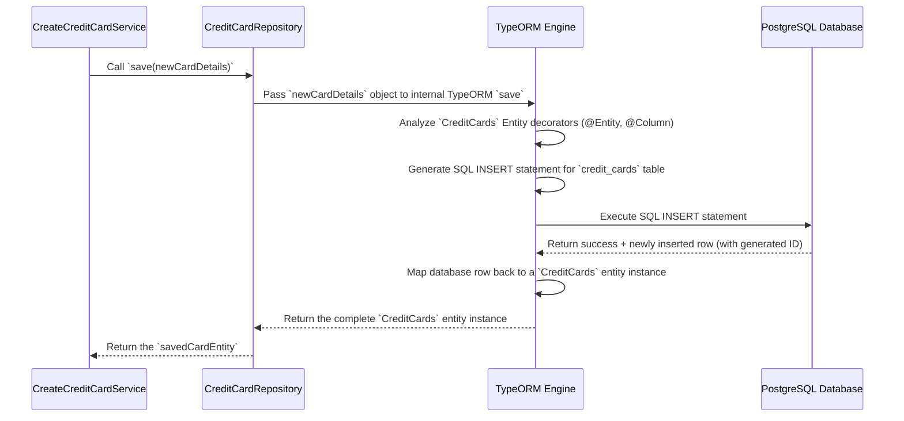

# Chapter 7: Database Entities & Repositories

In the last chapter, [Lithic Service Integration](06_lithic_service_integration.md), we saw how our service talks to our external partner, Lithic, the company that actually issues the credit cards. Lithic manages the core card details, but our own `credit-card-service` also needs to store information internally. For example, when a new card is created via Lithic, we need to save its details (like the last four digits, type, status, and which user it belongs to) in *our own* database.

How do we organize and manage all this data within our system? That's where **Database Entities** and **Repositories** come in.

## Why Do We Need Our Own Data Storage?

Imagine you run a library. You use a central cataloging system (like Lithic) to get official information about each book (ISBN, author, publisher). But you also need your own system to track:

*   Which specific copy of the book do *you* own? (Your internal ID)
*   Is *your* copy currently checked out, on the shelf, or being repaired? (Your internal status)
*   Which library member borrowed it last? (Link to your user data)
*   Did you add any special notes, like "Rare first edition"? (Your custom data)

Similarly, our `credit-card-service` uses a **PostgreSQL database** to store its own information about cards, accounts, users, transactions, payments, disputes, and more. Entities and Repositories are the tools we use to interact with this database cleanly and efficiently.

**Use Case:** When we create a new virtual card ([Chapter 2: Card Management Lifecycle](02_card_management_lifecycle.md)), after Lithic confirms the card is created, we need to save its details (like Lithic's ID for the card, the last four digits, the card type `VIRTUAL`, its initial `OPEN` status, and the `userId`) into our `credit_cards` table in our database.

## Concept 1: Entities (The Blueprints)

Think of an **Entity** as the blueprint for a specific type of data we want to store. It defines the structure, just like a blueprint defines the rooms and features of a house.

**Analogy:** Imagine a filing cabinet. An Entity is like the design specification for a particular type of folder. For example, a "Credit Card Folder" design might specify that each folder must have slots for:
*   Internal ID (a unique label we assign)
*   Card Type (Virtual or Physical)
*   Status (Pending, Open, Paused, Closed)
*   Last Four Digits
*   User ID (who owns this card?)
*   Expiry Date

In our code, an Entity is a TypeScript class decorated with special markers (`@Entity`, `@Column`, etc.) that tell our system how this class maps to a table in the database.

Here's a *simplified* example of the `CreditCards` entity:

```typescript
// File: database/entities/credit-cards.entity.ts (Simplified)
import { Entity, Column, PrimaryGeneratedColumn, ManyToOne, JoinColumn } from 'typeorm';
import { CardType, CardStatus } from '../../common/enums';
import { BaseEntity } from './base.entity'; // Contains common fields like 'id', 'createdAt'
import { User } from './user.entity'; // Link to the User entity

@Entity({ name: 'credit_cards' }) // Tells TypeORM this class maps to the 'credit_cards' table
export class CreditCards extends BaseEntity {

  @Column({ name: 'user_id', type: 'uuid' }) // Maps to the 'user_id' column (UUID type)
  userId: string;

  @Column({ name: 'external_card_id', type: 'varchar', nullable: true }) // Lithic's ID for the card
  externalCardId?: string;

  @Column({ type: 'enum', enum: CardType }) // Maps to an enum column for card type
  type: CardType; // e.g., CardType.VIRTUAL or CardType.PHYSICAL

  @Column({ type: 'enum', enum: CardStatus, default: CardStatus.PENDING }) // Enum for status
  status: CardStatus; // e.g., CardStatus.OPEN, CardStatus.PAUSED

  @Column({ type: 'varchar', name: 'last_four', nullable: true }) // Last 4 digits
  lastFour?: string;

  @Column({ type: 'varchar', nullable: true }) // Expiry date string
  expiry?: string;

  @Column({ name: 'is_activated', type: 'boolean', default: false }) // Has physical card been activated?
  isActivated: boolean;

  // --- Relationships ---
  // Defines a link to the User entity/table
  @ManyToOne(() => User) // Many cards can belong to one User
  @JoinColumn({ name: 'user_id' }) // Specifies the column used for the link
  user: User; // Allows us to access the related User object

  // ... other fields and relationships ...
}
```

*   `@Entity({ name: 'credit_cards' })`: This decorator marks the class as an Entity and links it to the `credit_cards` database table.
*   `@Column(...)`: This decorator marks a property as a column in the database table. It defines the column name, data type (`varchar`, `enum`, `boolean`, etc.), and other constraints (like `nullable: true`).
*   `@PrimaryGeneratedColumn()`: Often in `BaseEntity`, this defines the primary key column (usually `id`).
*   `@ManyToOne(...)`, `@OneToOne(...)`, `@OneToMany(...)`: These decorators define relationships between entities (e.g., a `CreditCards` belongs to one `User`).
*   `extends BaseEntity`: Many entities inherit common fields like `id`, `createdAt`, `updatedAt` from a `BaseEntity`.

You can find all the entity definitions in the `database/entities` folder. Each file (like `credit-card-account.entity.ts`, `credit-card-transaction.entity.ts`) defines the blueprint for a different type of data we store.

## Concept 2: Repositories (The Librarians)

Okay, we have the blueprints (Entities). How do we actually *use* them to interact with the database? We don't want to write raw SQL queries (`INSERT INTO credit_cards...`, `SELECT * FROM credit_cards WHERE...`) everywhere in our code. That would be repetitive, error-prone, and hard to manage.

Instead, we use **Repositories**. Think of a Repository as the librarian for a specific type of entity (folder).

**Analogy:** You don't go rummaging through the filing cabinet yourself. You go to the "Credit Card Librarian" (the `CreditCardRepository`) and say:
*   "Please **save** this new Credit Card folder." (`repository.save(newCardData)`)
*   "Please **find** the Credit Card folder with ID 'xyz'." (`repository.getById('xyz')`)
*   "Please **update** the status on folder 'xyz' to 'Paused'." (`repository.update('xyz', { status: CardStatus.PAUSED })`)
*   "Give me a **list** of all folders belonging to User 'abc'." (`repository.find({ where: { userId: 'abc' } })`)

Repositories provide methods that abstract away the database operations. They take our Entity objects (like a `CreditCards` instance) as input or return Entity objects as output.

In our code, we typically inject a Repository into a Service where we need database access. For example, the `CreateCreditCardService` would inject the `CreditCardRepository`.

```typescript
// File: apps/credit-card-api/src/modules/card-management/common/services/create-credit-card.service.ts (Simplified Snippet)
import { Injectable } from '@nestjs/common';
import { CreditCardRepository } from '../../../../../database/repositories'; // Import the repository
import { CreditCards } from '../../../../../database/entities'; // Import the entity
import { CardStatus, CardType } from '../../../../common/enums';
// ... other imports

@Injectable()
export class CreateCreditCardService {
  // We ask the system to give us an instance of CreditCardRepository
  constructor(private readonly cardsRepository: CreditCardRepository) {}

  async saveCardDetailsToDb(cardDetails: Partial<CreditCards>): Promise<CreditCards> {
    // We use the repository's 'save' method
    // It takes an object matching the CreditCards entity structure
    const savedCard = await this.cardsRepository.save(cardDetails);

    console.log(`Saved card with ID: ${savedCard.id}`);
    return savedCard;
  }

  // Example usage within the service
  async someOtherMethod() {
    const newCardData = {
      userId: 'user-123',
      externalCardId: 'lithic-card-abc',
      type: CardType.VIRTUAL,
      status: CardStatus.OPEN,
      lastFour: '1111',
      expiry: '12/2028',
      isActivated: true,
      // ... other necessary fields ...
    };
    const cardInDb = await this.saveCardDetailsToDb(newCardData);
    // Now 'cardInDb' holds the full record saved in the database, including its generated ID
  }
}
```

*   `constructor(private readonly cardsRepository: CreditCardRepository)`: This uses NestJS dependency injection to get an instance of the `CreditCardRepository`.
*   `await this.cardsRepository.save(cardDetails)`: This calls the `save` method on the repository, passing an object containing the data for the new card. The repository handles converting this into an SQL `INSERT` statement and executing it.

Most repositories in our project extend a `BaseRepository` which provides common methods like `save`, `update`, `getById`, `getAll`, `getOne`, `delete`. You can find repository definitions in the `database/repositories` folder.

```typescript
// File: database/repositories/base.repository.ts (Simplified 'save' method)
import { DeepPartial, EntityManager, Repository } from 'typeorm';

export abstract class BaseRepository<TEntity> {
  private readonly _repository: Repository<TEntity>;
  constructor(childRepository: Repository<TEntity>) {
    this._repository = childRepository; // Gets the actual TypeORM repository
  }

  // Saves an entity or updates it if it already exists
  async save(data: DeepPartial<TEntity>, transactionManager?: EntityManager): Promise<TEntity> {
    const repository = transactionManager ? transactionManager.getRepository(this._repository.target) : this._repository;
    // The core logic: TypeORM's repository.save handles INSERT or UPDATE
    return repository.save(data);
  }

  // ... other common methods like getById, update, delete, etc. ...
}
```

This `BaseRepository` provides a foundation, so individual repositories like `CreditCardRepository` often only need to define custom query methods if the basic ones aren't sufficient.

## How It Connects: The ORM (TypeORM)

How do the Entity classes (blueprints) and Repository methods (librarian actions) actually interact with the PostgreSQL database? This magic is performed by an **Object-Relational Mapper (ORM)**. Our project uses **TypeORM**.

The ORM is like the engine connecting the blueprints and the librarian's instructions to the actual physical filing cabinet (the database).

*   It reads the `@Entity` and `@Column` decorators to understand the structure.
*   When you call `repository.save(card)`, it automatically generates the correct SQL `INSERT` statement.
*   When you call `repository.getById('xyz')`, it generates the SQL `SELECT * FROM credit_cards WHERE id = 'xyz'` statement.
*   It takes the results from the database and transforms them back into instances of your Entity classes (like `CreditCards`).

You don't usually interact with TypeORM directly in day-to-day coding. You work with Entities and Repositories. TypeORM handles the translation to/from SQL behind the scenes. Its configuration, connecting it to our PostgreSQL database, happens in modules like `libs/pg/src/pg.module.ts`.

## Solving the Use Case: Saving a New Card

Let's revisit our use case: saving a new virtual card's details after Lithic creates it.

1.  **Get Data:** Our `CreateCreditCardService` gets the card details back from the [Lithic Service Integration](06_lithic_service_integration.md) (e.g., `externalCardId`, `lastFour`). It already knows the `userId`, `type` (VIRTUAL), and `status` (OPEN).
2.  **Prepare Entity Object:** It creates a plain JavaScript object that matches the structure of the `CreditCards` entity.
    ```typescript
    const newCardDetails: Partial<CreditCards> = {
      userId: 'user-uuid-123',
      externalCardId: 'lithic-card-token-abc',
      type: CardType.VIRTUAL,
      status: CardStatus.OPEN,
      lastFour: '1111',
      expiry: '12/2028',
      isActivated: true, // Virtual cards start activated
      // ... other necessary fields from BaseEntity might be handled automatically ...
    };
    ```
3.  **Call Repository:** It calls the `save` method on the injected `CreditCardRepository`.
    ```typescript
    // In CreateCreditCardService...
    // constructor(private readonly cardsRepository: CreditCardRepository) {}

    async saveCardToDatabase(details: Partial<CreditCards>) {
        console.log('Attempting to save card to DB:', details);
        const savedCardEntity = await this.cardsRepository.save(details);
        console.log('Card saved successfully! DB ID:', savedCardEntity.id);
        return savedCardEntity;
    }

    // Later...
    const cardFromDb = await this.saveCardToDatabase(newCardDetails);
    // 'cardFromDb' now contains the full entity, including the auto-generated 'id'
    ```

The `cardsRepository.save(newCardDetails)` call triggers TypeORM to generate and execute an SQL `INSERT` statement into the `credit_cards` table, storing the new card's information.

## Under the Hood: The `save` Flow

What happens when `cardsRepository.save()` is called?



1.  The service calls the repository's `save` method with the data object.
2.  The repository (often via the `BaseRepository`) calls TypeORM's underlying `save` function.
3.  TypeORM looks at the `CreditCards` entity definition to know which table and columns to use.
4.  It constructs the appropriate SQL `INSERT` query.
5.  It sends the SQL query to the PostgreSQL database driver.
6.  The database executes the query and inserts the row.
7.  The database confirms success and returns the newly inserted data (including any auto-generated values like the `id`).
8.  TypeORM receives the raw database result and maps it back into a full `CreditCards` entity object.
9.  This entity object is returned back to the service.

## Conclusion

In this chapter, we learned about the core components for managing data within our `credit-card-service`:

*   **Entities:** TypeScript classes (`database/entities/*.ts`) decorated to act as blueprints for database tables (e.g., `CreditCards`, `CreditCardAccount`). They define the structure and relationships of our data.
*   **Repositories:** Classes (`database/repositories/*.ts`) that act as managers or "librarians" for specific entities. They provide methods (`save`, `find`, `update`, `delete`) to interact with the database using Entity objects, hiding the complexity of SQL.
*   **TypeORM:** The Object-Relational Mapper working behind the scenes, translating between our TypeScript Entities/Repositories and the PostgreSQL database.

Using Entities and Repositories makes our database interactions structured, type-safe, and easier to manage compared to writing raw SQL everywhere. They provide a crucial abstraction layer for data persistence.

Many database operations, like processing payments or handling webhook updates, shouldn't block the main flow of our application. How do we handle these tasks efficiently in the background?

**Next:** [Asynchronous Workers (RabbitMQ)](08_asynchronous_workers__rabbitmq_.md)

---

Generated by [AI Codebase Knowledge Builder](https://github.com/The-Pocket/Tutorial-Codebase-Knowledge)