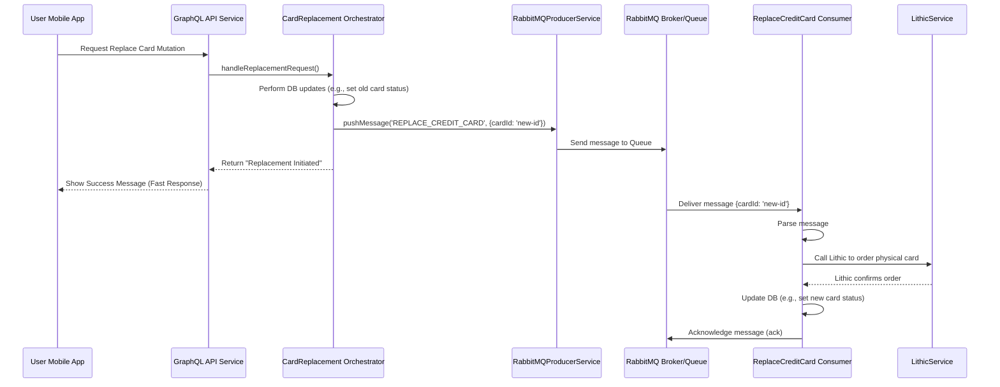

# Chapter 8: Asynchronous Workers (RabbitMQ)

In [Chapter 7: Database Entities & Repositories](07_database_entities___repositories.md), we learned how our `credit-card-service` stores its own data using blueprints (Entities) and managers (Repositories). But what happens when the service needs to do something that might take a while, like contacting an external partner or processing a complex task? If the main API waits for these slow tasks to finish, the user's app would feel sluggish and unresponsive.

This chapter introduces **Asynchronous Workers** and how we use a tool called **RabbitMQ** to handle background tasks without slowing down the main application.

## Why Do We Need Background Work? The Slow Prep Kitchen

Imagine you're ordering food at a busy restaurant counter. You place your order for a complex sandwich. Does the person at the counter stop everything and go chop the vegetables, toast the bread, and grill the chicken while you wait? No! That would take too long and hold up the entire line.

Instead, the counter staff takes your order quickly and sends it back to the **prep kitchen**. There, other cooks (workers) handle the time-consuming tasks like chopping, grilling, etc. The front counter stays fast and responsive, taking orders from other customers. Once your sandwich is ready, someone brings it out to you.

Our `credit-card-service` works similarly. Some tasks don't need to happen *immediately* when a user interacts with the API, or they might take a significant amount of time:

*   Ordering a physical card from Lithic and arranging shipping.
*   Processing updates received from Lithic via webhooks (like a transaction finally settling).
*   Performing steps in the payment process (like actually moving money between accounts).
*   Generating complex reports.

If our main API endpoint (like the GraphQL endpoints from [Chapter 1: GraphQL API Endpoints](01_graphql_api_endpoints.md)) tried to do these slow tasks directly, the user's app would freeze or show a loading spinner for a long time. This is a bad user experience.

To solve this, we use **Asynchronous Workers**. The main API quickly records the *request* for the task and then hands off the actual work to a background worker process. This keeps the API fast.

**Use Case:** A customer requests a replacement physical credit card using the mobile app. The app sends a `replaceCard` mutation. Our API needs to tell Lithic to close the old card and create/ship a new one. This interaction with Lithic and the shipping logistics can take time. The API shouldn't wait for all of that.

## What is RabbitMQ? The System's Post Office

How does the main API hand off tasks to the background workers? We use a **message broker** called **RabbitMQ**.

Think of RabbitMQ as a highly efficient post office or a central to-do list manager for our system:

1.  **Producers (Sending Mail):** When a part of our system (like the API service handling the `replaceCard` mutation) needs a background task done, it acts as a **Producer**. It writes a "letter" (a **message**) describing the task (e.g., "Replace card ID 123 for user ABC") and puts it in a specific mailbox (a **Queue**).
2.  **Queues (Mailboxes):** RabbitMQ holds these messages in named **Queues**. Each queue is typically for a specific type of task (e.g., `REPLACE_CREDIT_CARD` queue, `PROCESS_WEBHOOK` queue). Messages wait in the queue like letters in a mailbox.
3.  **Consumers (Picking Up Mail):** Separate background processes, called **Consumers** or **Workers**, are constantly watching specific queues. When a new message appears in a queue they watch, a worker picks it up (like a mail carrier collecting letters).
4.  **Processing:** The worker reads the message and performs the actual task described (e.g., calls the [Lithic Service Integration](06_lithic_service_integration.md) to order the replacement card).

This setup decouples the task request (from the API) from the task execution (by the worker). The API doesn't need to know which worker will do the job or when; it just needs to drop the message in the right RabbitMQ queue.

## How it Works in `credit-card-service`

Let's revisit our use case: replacing a physical card.

1.  **API Request:** The user requests a replacement via the app, triggering the `replaceCard` GraphQL mutation.
2.  **API Service (Producer):** The service handling the mutation (e.g., `ReplaceCreditCardService`) performs quick checks (is the user allowed? is the card valid?). It might update the old card's status in *our* database to `PENDING_REPLACEMENT`.
3.  **Send Message:** Instead of calling Lithic directly, the service uses our internal `RabbitMQProducerService` to send a message to the `REPLACE_CREDIT_CARD` queue. The message contains the necessary information, like the ID of the *new* card record created in our database (which is still pending activation/shipping).
    ```typescript
    // Simplified message content
    const messagePayload = {
      cardId: 'new-card-db-id-456' // ID of the card record needing Lithic processing
    };
    ```
4.  **Fast API Response:** The API service, having successfully sent the message to RabbitMQ, immediately returns a success response to the user's app (e.g., "Your replacement card order has been submitted."). The user experience is quick!
5.  **Worker (Consumer):** A separate application (often called `credit-card-workers`) is running in the background. It has **Consumers** listening to RabbitMQ queues. One consumer is specifically listening to the `REPLACE_CREDIT_CARD` queue.
6.  **Receive Message:** This consumer picks up the message containing `{ cardId: 'new-card-db-id-456' }`.
7.  **Perform Slow Task:** The consumer's code now executes the long-running logic:
    *   It fetches the details of the card record `'new-card-db-id-456'` from our database ([Database Entities & Repositories](07_database_entities___repositories.md)).
    *   It calls the `LithicService` ([Lithic Service Integration](06_lithic_service_integration.md)) to actually order the physical card from Lithic.
    *   It might update the card record in our database with shipping details or confirmation from Lithic.

This entire slow process happens in the background, invisible to the user who already received a confirmation from the fast API response.

## Code Examples (Simplified)

Let's look at how the code handles sending and receiving messages.

### Sending a Message (Producer)

Here's a simplified example of a service pushing a message to RabbitMQ after creating the database record for a replacement card.

```typescript
// File: (Conceptual) Part of a service like ReplaceCreditCardService
import { Injectable } from '@nestjs/common';
import { RabbitMQProducerService } from '@app/rabbit-mq'; // Service to send messages
import { RABBITMQ } from '../../../../common/constants'; // Contains queue names

@Injectable()
export class CardReplacementOrchestrator { // Simplified name
  constructor(
    private readonly rabbitMQProducerService: RabbitMQProducerService,
    // ... other needed repositories/services ...
  ) {}

  async handleReplacementRequest(userId: string, oldCardId: string) {
    // 1. Perform initial checks and database updates...
    //    (e.g., close old card in DB, create NEW card record in PENDING state)
    const newCardRecordId = 'generated-db-id-for-new-card'; // Assume this was created

    // 2. Prepare the message payload for the background worker
    const messagePayload = {
      cardId: newCardRecordId,
      // Maybe include userId or other relevant info
    };

    // 3. Push the message to the specific RabbitMQ queue
    await this.rabbitMQProducerService.pushMessage(
      RABBITMQ.QUEUES.REPLACE_CREDIT_CARD, // Specify the target queue name
      messagePayload                   // The data for the worker
    );

    console.log(`Message sent to REPLACE_CREDIT_CARD queue for card ${newCardRecordId}`);

    // 4. Return a fast success response to the caller (e.g., the API resolver)
    return { success: true, message: "Replacement initiated." };
  }
}
```

*   `RabbitMQProducerService`: This service (from `libs/rabbit-mq/src/producer.service.ts`) provides the `pushMessage` method.
*   `RABBITMQ.QUEUES.REPLACE_CREDIT_CARD`: We use constants (`common/constants/rabbitmq.constants.ts`) to store queue names, avoiding typos.
*   `pushMessage(queueName, payload)`: This sends the `payload` object as a message to the specified `queueName` in RabbitMQ.

### Receiving and Processing a Message (Consumer)

Now, let's look at the worker side that picks up and processes this message. This code typically lives in a separate application (e.g., `apps/credit-card-workers`).

```typescript
// File: apps/credit-card-workers/src/modules/card-management/replace-card/index.ts (Conceptual Structure)
import { Injectable } from '@nestjs/common';
import * as amqp from 'amqplib'; // RabbitMQ library types
import { ReplaceCreditCardConsumer } from './replace-card.consumer'; // The actual logic handler
import { RabbitMQConsumerService } from '@app/rabbit-mq'; // Helper for setup/decryption

@Injectable() // Marks this class for NestJS dependency injection
export class ReplaceCreditCard {
  constructor(
    // Inject the service that contains the actual processing logic
    private readonly replaceCreditCardConsumer: ReplaceCreditCardConsumer,
    // Inject the RabbitMQ helper service
    private readonly consumerService: RabbitMQConsumerService
  ) {}

  // This function is registered to handle messages from a specific queue
  async consumer(message: amqp.ConsumeMessage, channel: amqp.Channel) {
    try {
      // 1. Decrypt and parse the message content
      const messagePayload = this.consumerService.decryptMsg(message.content);
      console.log('Received message:', messagePayload);

      // 2. Call the dedicated consumer logic handler
      const result = await this.replaceCreditCardConsumer.handle(messagePayload);

      // 3. Acknowledge the message if processed successfully
      if (result.status === 'processed') {
        channel.ack(message); // Tell RabbitMQ the message is done, remove from queue
        console.log('Message processed and acknowledged.');
      } else {
        // Handle failures (e.g., log, send to a dead-letter queue, or nack to retry)
        console.warn('Message processing failed, not acknowledging:', result.message);
        channel.nack(message, false, false); // Tell RabbitMQ processing failed
      }
    } catch (error) {
      console.error('Error in consumer:', error);
      // Ensure message is not lost if an unexpected error occurs
      channel.nack(message, false, false);
    }
  }
}

// File: apps/credit-card-workers/src/modules/card-management/replace-card/replace-card.consumer.ts (Conceptual Logic)
import { Injectable } from '@nestjs/common';
import { LithicService } from '@app/lithic'; // To talk to Lithic
import { CreditCardRepository } from '../../../../../../database/repositories'; // To access DB

@Injectable()
export class ReplaceCreditCardConsumer {
  constructor(
    private readonly lithicService: LithicService,
    private readonly cardRepository: CreditCardRepository
    // ... other services
  ) {}

  async handle(payload: { cardId: string }): Promise<{ status: string; message?: string }> {
    console.log(`Processing replacement for cardId: ${payload.cardId}`);
    try {
      // 1. Fetch card details from database using payload.cardId
      const card = await this.cardRepository.getById(payload.cardId);
      if (!card || card.status !== 'PENDING') { /* ... handle error ... */ }

      // 2. Prepare data and call LithicService to order the physical card
      // const lithicResponse = await this.lithicService.reissuePhysicalCard(...)
      console.log(`Calling LithicService for card ${payload.cardId}... (Simulated)`);
      await new Promise(resolve => setTimeout(resolve, 2000)); // Simulate delay

      // 3. Update card status in DB (e.g., to AWAITING_SHIPMENT)
      // await this.cardRepository.update(payload.cardId, { status: CardStatus.AWAITING_SHIPMENT });
      console.log(`Updated DB status for card ${payload.cardId}`);

      return { status: 'processed' };
    } catch (error) {
      console.error(`Failed to process replacement for ${payload.cardId}`, error);
      return { status: 'failed', message: error.message };
    }
  }
}
```

*   **Setup (`ReplaceCreditCard` class):** This class often handles the boilerplate of connecting to RabbitMQ, decrypting messages, and acknowledging them. It gets the message via its `consumer` method (which is configured in `consumers.config.ts` - see below).
*   **Logic (`ReplaceCreditCardConsumer` class):** This class contains the actual business logic (`handle` method). It receives the message payload and performs the necessary actions (fetching data, calling `LithicService`, updating the database).
*   **Acknowledgement (`channel.ack(message)`):** This is crucial. It tells RabbitMQ, "Okay, I finished processing this message successfully, you can delete it from the queue." If the worker crashes or fails without acknowledging (`channel.nack(...)`), RabbitMQ will usually give the message to another available worker later, ensuring tasks aren't lost.

The connection between the queue name (`RABBITMQ.QUEUES.REPLACE_CREDIT_CARD`) and the `ReplaceCreditCard.consumer` method is typically defined in a central configuration file within the workers application:

```typescript
// File: apps/credit-card-workers/src/modules/consumers.config.ts (Simplified Snippet)
// ... imports for queue names and consumer classes ...

@Injectable()
export class ConsumersConfigService {
  constructor(
    // Inject instances of all the consumer setup classes
    private readonly replaceCreditCard: ReplaceCreditCard,
    private readonly createCreditCard: CreateCreditCard,
    private readonly processWebhook: ProcessWebhook,
    // ... many other consumers ...
  ) {}

  getConfigs(): IConsumerConfig[] {
    const configs = [
      // Configuration for the Replace Credit Card consumer
      {
        consumerCount: 1, // How many instances of this worker should run
        queueName: RABBITMQ.QUEUES.REPLACE_CREDIT_CARD, // Which queue to listen to
        consumerFunc: this.replaceCreditCard.consumer.bind(this.replaceCreditCard), // Which function handles messages
        // ... other options like prefetch count ...
      },
      // Configuration for the Create Credit Card consumer
      {
        consumerCount: 2,
        queueName: RABBITMQ.QUEUES.CREATE_CREDIT_CARD,
        consumerFunc: this.createCreditCard.consumer.bind(this.createCreditCard),
        // ...
      },
      // Configuration for the Webhook processor
      {
        consumerCount: 3,
        queueName: RABBITMQ.QUEUES.PROCESS_CREDIT_CARD_WEBHOOK,
        consumerFunc: this.processWebhook.consumer.bind(this.processWebhook),
        // ...
      },
      // ... configurations for all other queues and consumers ...
    ];
    return configs;
  }
}
```
This configuration tells the `RabbitMQConsumerService` which function to call for messages arriving on each specific queue.

## Under the Hood: The Message Flow

Here's a simplified view of the message flow using RabbitMQ for our card replacement example:



## Where Else Do We Use Workers?

Asynchronous workers powered by RabbitMQ are essential throughout the `credit-card-service`:

*   **Creating Physical Cards:** Similar to replacement, ordering a *new* physical card involves calling Lithic and waiting, so it's done via a worker listening to the `CREATE_CREDIT_CARD` queue ([Card Management Lifecycle](02_card_management_lifecycle.md)).
*   **Processing Webhooks:** When Lithic sends us updates (like transaction settled, dispute updated), the initial receiver endpoint just puts the webhook data onto a queue (e.g., `PROCESS_CREDIT_CARD_WEBHOOK`). Workers then pick these up to update our database, ensuring the webhook endpoint responds quickly to Lithic ([Transaction Processing (ASA & Webhooks)](03_transaction_processing__asa___webhooks_.md), [Dispute Management](05_dispute_management.md)).
*   **Payment Processing:** Moving money (via `RailsService`) and notifying Lithic about payments involves steps that might fail or take time. These are handled by workers listening to queues like `PROCESS_CREDIT_CARD_PAYMENT` and `PROCESS_CREDIT_CARD_PAYMENT_AT_LITHIC` ([Payment Processing (Manual & AutoPay)](04_payment_processing__manual___autopay_.md)).
*   **AutoPay:** The background job that triggers AutoPay (`AutopayCron`) pushes messages to the `AUTOPAY_REQUEST` queue, and a worker (`AutopayConsumer`) handles calculating the amount, checking funds, and initiating the payment process ([Payment Processing (Manual & AutoPay)](04_payment_processing__manual___autopay_.md)).
*   **Account Creation & Updates:** Certain steps after KYB/KYC approval, like setting up the account at Lithic and onboarding for rewards, are triggered via messages on queues like `CREATE_CREDIT_CARD_ACCOUNT`.
*   **Report Generation:** Creating complex settlement or loan tape reports often happens in background workers triggered by messages on specific queues.

Essentially, any task that isn't instantaneous or shouldn't block the main API flow is a good candidate for being handled by an asynchronous worker using RabbitMQ. These workers run as part of the `credit-card-workers` application.

## Conclusion

You've learned about the importance of **Asynchronous Workers** for keeping our `credit-card-service` responsive. We saw how:

*   Slow or non-immediate tasks are offloaded to background workers.
*   **RabbitMQ** acts as a message broker (a post office) to manage these tasks.
*   **Producers** (like API services) send messages (tasks) to **Queues**.
*   **Consumers** (workers in `credit-card-workers`) pick up messages from queues and perform the actual work.
*   This pattern uses services like `RabbitMQProducerService` and `RabbitMQConsumerService` along with specific consumer logic classes.
*   Key benefits include improved API speed and better reliability (tasks can be retried if a worker fails).

While workers handle tasks triggered by events (like an API call or a webhook), some tasks need to run automatically on a regular schedule (like checking for due payments or generating nightly reports). How does the system handle those?

**Next:** [Cron Jobs](09_cron_jobs.md)

---

Generated by [AI Codebase Knowledge Builder](https://github.com/The-Pocket/Tutorial-Codebase-Knowledge)