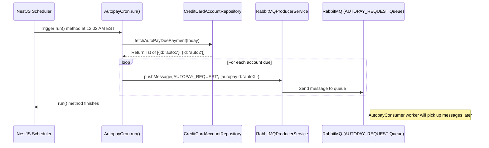

# Chapter 9: Cron Jobs

In [Chapter 8: Asynchronous Workers (RabbitMQ)](08_asynchronous_workers__rabbitmq_.md), we saw how the `credit-card-service` uses background workers and RabbitMQ to handle tasks that might take a while, like ordering a physical card or processing a payment, without slowing down the main application. But what about tasks that need to happen automatically at specific times, like clockwork?

Imagine you want your phone to remind you every morning at 8 AM to take your vitamins. You wouldn't manually set an alarm *every single night*. You'd set a recurring alarm that goes off automatically. That's exactly what Cron Jobs do for our software system.

## What's a Cron Job? The System's Alarm Clock

A **Cron Job** is simply a **scheduled task**. It's like setting an alarm clock or a recurring calendar reminder for the `credit-card-service`. You tell the system, "Run this specific piece of code automatically at this exact time or interval," and it does.

These times can be very specific:
*   "Every day at 2:00 AM"
*   "Every 15 minutes"
*   "At 5:00 PM on the first day of every month"

**Analogy:** Think of your office cleaning crew. They don't wait for someone to call them every day. They have a schedule – maybe they come in every night at 10 PM automatically to clean up. Cron Jobs are the automated cleaning crew (or reminder system, or report generator) for our application.

## Why Do We Need Cron Jobs? Automating Routine Tasks

Many tasks in a financial service need to happen regularly without someone manually clicking a button each time. Cron Jobs are perfect for this automation.

**Use Case: Triggering AutoPay:**
Remember AutoPay from [Chapter 4: Payment Processing (Manual & AutoPay)](04_payment_processing__manual___autopay_.md)? Customers can set up automatic payments for their credit card bills, usually on the due date. How does the system *know* when to actually initiate that payment? It doesn't rely on a human remembering! A Cron Job runs automatically every day (e.g., just after midnight) to check which accounts are due for an AutoPay payment *today* and kicks off the process for them.

Other examples in `credit-card-service` include:

*   **Sending Reminders:** A Cron Job runs daily to find physical cards that were shipped but not activated after a certain number of days (e.g., 10 days) and sends a reminder email/push notification to the user (`PhysicalCardActivationReminderCron`).
*   **Syncing Data:** Cron Jobs run periodically (e.g., multiple times a day) to fetch settlement report summaries from Lithic to ensure our records match theirs (`LithicSummaryCron`).
*   **Generating Reports:** A Cron Job runs nightly to generate important financial data reports, like the "Loan Tape" report, which details outstanding balances (`GenerateLoanTapeReportCron`).
*   **Retrying Failed Tasks:** If a payment processing attempt failed temporarily, a Cron Job might run periodically to retry those specific failed payments (`RetryPaymentCron` - not shown in detail, but follows the same principle).

## How Cron Jobs Work in Our Service (`@nestjs/schedule`)

Our project uses a library built into the NestJS framework called `@nestjs/schedule` to manage Cron Jobs. It makes defining scheduled tasks quite straightforward.

The core piece is the `@Cron()` decorator. You place this decorator above a function within a service class, and the framework takes care of running that function according to the schedule you specify.

```typescript
// Simplified example structure
import { Injectable } from '@nestjs/common';
import { Cron, CronExpression } from '@nestjs/schedule';
import { LoggerService } from '@app/logger'; // For logging messages

@Injectable() // Marks this class as a service managed by NestJS
export class MyScheduledTasks {
  constructor(private readonly logger: LoggerService) {}

  // This function will run automatically based on the @Cron decorator
  @Cron(CronExpression.EVERY_DAY_AT_MIDNIGHT, { // Defines the schedule
    name: 'daily_cleanup_job', // Give the job a name
    timeZone: 'America/New_York', // Important: Specify the time zone!
  })
  async handleDailyCleanup() {
    this.logger.info('DAILY_CLEANUP', 'Starting the daily cleanup task...');
    // --- Add the code to run here ---
    // For example: Find old records and mark them as archived.
    // Or: Trigger a background job via RabbitMQ.
    console.log('Performing cleanup...');
    // --- Task finished ---
    this.logger.info('DAILY_CLEANUP', 'Daily cleanup task finished.');
  }
}

```

*   `@Injectable()`: Standard NestJS decorator making this class available for use.
*   `@Cron()`: The magic decorator! This tells NestJS that the `handleDailyCleanup` method is a scheduled task.
    *   `CronExpression.EVERY_DAY_AT_MIDNIGHT`: This is a pre-defined schedule string. You can also use custom "cron syntax" strings (like `'0 8 * * *'` for 8:00 AM daily). Our project defines common schedules in `apps/credit-card-cron-jobs/src/common/constants/cron.constants.ts`.
    *   `name`: Gives the job a unique name for logging and management. We store names in `apps/credit-card-cron-jobs/src/common/enums/cron.enum.ts`.
    *   `timeZone`: Crucial! Specifies the time zone for the schedule (e.g., `'America/New_York'`). Without this, the job might run at midnight UTC instead of midnight EST.

When the `credit-card-cron-jobs` application starts, NestJS finds all the methods decorated with `@Cron` and sets up internal timers to run them according to their schedules.

## Cron Jobs Often Delegate to Workers

Cron Jobs need to be reliable, but they shouldn't perform super long-running or complex tasks *directly within the scheduled function*. Why? If the task takes too long, it might interfere with the next scheduled run, or if it fails midway, it can be hard to manage.

Just like our API services often delegate work, **Cron Jobs very often act as triggers for background workers**.

The typical pattern is:
1.  The Cron Job runs at its scheduled time.
2.  It performs minimal work, like figuring out *what* needs to be done (e.g., which users need an AutoPay payment today? which report needs generating?).
3.  It sends one or more messages to a specific RabbitMQ queue ([Asynchronous Workers (RabbitMQ)](08_asynchronous_workers__rabbitmq_.md)), containing the details of the work to be done.
4.  The actual heavy lifting is then performed by a worker (Consumer) listening to that queue.

This keeps the Cron Job function itself short, fast, and focused on *scheduling*, while the robust processing happens asynchronously in the background worker system.

Let's look at our AutoPay use case again.

### Example: The AutoPay Cron Job (`AutopayCron`)

This job runs daily to find accounts due for AutoPay and trigger the payment process.

```typescript
// File: apps/credit-card-cron-jobs/src/modules/payment/autopay.cron.ts (Simplified)
import { Injectable } from '@nestjs/common';
import { Cron } from '@nestjs/schedule';
import * as moment from 'moment-timezone';
import { LoggerService } from '@app/logger';
import { RabbitMQProducerService } from '@app/rabbit-mq'; // To send messages
import { CreditCardAccountRepository } from '../../../../../database/repositories'; // To find accounts
import { CRON_NAMES } from '../../common/enums';
import { TimeZones } from '../../../../../common/enums';
import { RABBITMQ } from '../../../../../common/constants';
import { IAutopayEvent } from 'apps/credit-card-workers/src/common/interfaces'; // Message format

// Schedule: Every day at 2 minutes past midnight EST (Production)
// (Uses a helper function to allow different timing in non-production)
@Injectable()
export class AutopayCron {
  constructor(
    private readonly loggerService: LoggerService,
    private readonly mqProducerService: RabbitMQProducerService, // Injected service to talk to RabbitMQ
    private readonly creditCardAccountRepository: CreditCardAccountRepository, // Injected repo to talk to DB
  ) {}

  @Cron(/* ... schedule defined by getCronExpression() ... */, {
    name: CRON_NAMES.AUTO_PAY, // Job name from constants
    timeZone: TimeZones.EST,   // Run in Eastern Standard Time
  })
  private async run() {
    this.loggerService.info(AutopayCron.name, 'Running autopay cron job');
    try {
      // 1. Figure out what date "today" is in EST
      const todayDate = moment().tz(TimeZones.EST).format('YYYY-MM-DD');

      // 2. Ask the database for accounts due today that have active AutoPay
      //    (The actual query logic is inside the repository method)
      const accountsDue = await this.creditCardAccountRepository.fetchAutoPayDuePayment(todayDate);
      this.loggerService.info(AutopayCron.name, `Found ${accountsDue.length} accounts for AutoPay today`);

      // 3. For each account found, push a message to the RabbitMQ worker queue
      for (const { id: autopayId } of accountsDue) {
        const eventPayload: IAutopayEvent = { autopayId /* ... other details ... */ };
        // Delegate the actual payment processing to a worker via RabbitMQ
        this.mqProducerService.pushMessage(RABBITMQ.QUEUES.AUTOPAY_REQUEST, eventPayload);
      }

      this.loggerService.info(AutopayCron.name, 'Autopay cron job completed successfully');
    } catch (error) {
      this.loggerService.error(AutopayCron.name, 'Error running autopay cron job', { error });
    }
  }
}
```

*   **`@Cron(...)`**: Sets the schedule (daily at 12:02 AM EST).
*   **Step 1 & 2**: The job does minimal work: gets the date and queries the database using `creditCardAccountRepository` to find the relevant `autopayId`s for today.
*   **Step 3**: The core delegation step! For each `autopayId`, it calls `mqProducerService.pushMessage`. It sends a message containing the `autopayId` to the `AUTOPAY_REQUEST` queue in RabbitMQ.
*   **Finish**: The cron job itself is done. It doesn't wait for payments to process. The actual payment logic (checking funds, creating payment records, calling Rails, notifying Lithic) is handled by the `AutopayConsumer` worker described in [Chapter 8: Asynchronous Workers (RabbitMQ)](08_asynchronous_workers__rabbitmq_.md).

### Under the Hood: Cron Job Triggering a Worker



This diagram shows the Cron Job's role: wake up on schedule, figure out *what* needs doing, and tell RabbitMQ to queue up the *actual* work for a background worker.

This pattern is used by most cron jobs in the `credit-card-cron-jobs` application. They identify tasks based on time (daily reminders, nightly reports, due dates) and then push messages to the appropriate RabbitMQ queues for dedicated workers to handle the processing.

## Conclusion

You've now learned about **Cron Jobs**, the system's automated schedulers:

*   They are tasks that run automatically at specific times or intervals (like an alarm clock).
*   They are essential for automating recurring tasks like triggering AutoPay, sending reminders, syncing data, and generating reports.
*   We use the `@nestjs/schedule` library and the `@Cron()` decorator to define them in the `credit-card-cron-jobs` application.
*   Crucially, Cron Jobs often delegate the heavy lifting to background workers by pushing messages to RabbitMQ queues ([Asynchronous Workers (RabbitMQ)](08_asynchronous_workers__rabbitmq_.md)), keeping the scheduled function itself quick and focused.

With Cron Jobs handling scheduled automation and workers handling background tasks, our `credit-card-service` can manage many complex operations efficiently. But how do all these different parts (API, workers, cron jobs) know *how* to connect to databases, RabbitMQ, Lithic, and other services? They need configuration settings.

**Next:** [Configuration Management](10_configuration_management.md)

---

Generated by [AI Codebase Knowledge Builder](https://github.com/The-Pocket/Tutorial-Codebase-Knowledge)