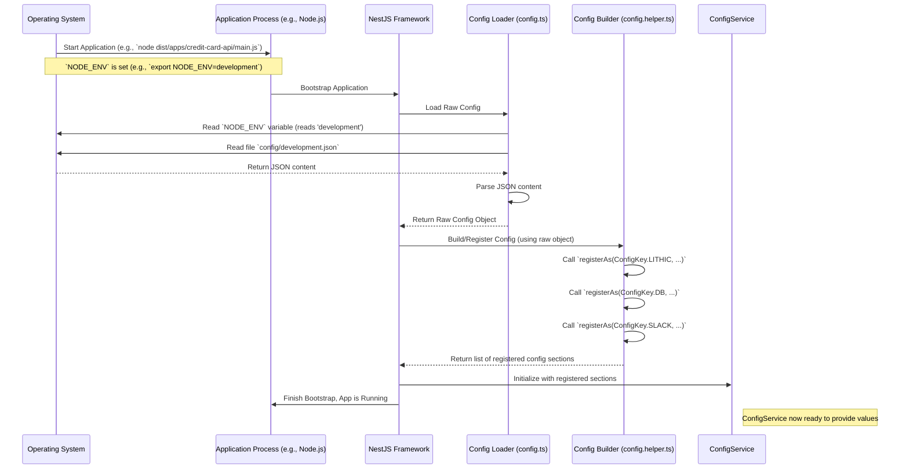

# Chapter 10: Configuration Management

In the previous chapter, [Cron Jobs](09_cron_jobs.md), we saw how the `credit-card-service` automates tasks that need to run on a schedule, like triggering AutoPay or sending reminders. Both Cron Jobs and the [Asynchronous Workers (RabbitMQ)](08_asynchronous_workers__rabbitmq_.md) often need to connect to external services (like [Lithic Service Integration](06_lithic_service_integration.md)) or our own database ([Database Entities & Repositories](07_database_entities___repositories.md)).

But how do these different parts of our application know *how* to connect? Where do we store things like database passwords, secret API keys for Lithic, or the address for the RabbitMQ server? We certainly don't want to write these sensitive details directly into our code! This is where **Configuration Management** comes in.

## What's the Problem? Hardcoding is Bad!

Imagine you're writing a program that needs to connect to a database. You could write the database address, username, and password directly into your code:

```typescript
// DON'T DO THIS! Example of bad hardcoding:
const dbHost = 'localhost';
const dbUser = 'myuser';
const dbPassword = 'mysecretpassword123'; // <-- Uh oh! Secret in code!
connectToDatabase(dbHost, dbUser, dbPassword);
```

This seems easy at first, but it causes huge problems:

1.  **Security Risk:** Anyone who sees the code now knows your secret password! If you commit this code to a shared repository (like Git), the secret is exposed.
2.  **Different Environments:** When you run the code on your own laptop (`local`), you might connect to a test database. But when the code runs live for real users (`production`), it needs to connect to the *real* database with a different address and password. How do you manage that change? You'd have to edit the code every time you deploy it, which is error-prone.
3.  **Changes:** What if the database password needs to change? You'd have to find every place in the code where it was written and update it.

We need a better way to handle these settings.

## Configuration Management: The Application's Control Panel

**Configuration Management** is the process of handling all the settings an application needs to run correctly, especially settings that change depending on where the application is running.

**Analogy:** Think of your car's dashboard or a plane's cockpit. It's the control panel. It has gauges and settings. Some settings might change based on the situation (like switching from "Eco" driving mode to "Sport" mode). Configuration Management is like the system that provides the right settings to the car's engine based on the selected mode.

In our `credit-card-service`, configuration settings include:

*   **Database Credentials:** Host address, port, username, password.
*   **API Keys:** Secret keys for talking to Lithic, Zendesk, Slack, Rudderstack, etc.
*   **Service URLs:** Addresses for other internal services (like the Mailer service or Rails wallet service).
*   **Feature Flags:** Simple on/off switches to enable or disable certain features without changing code.
*   **Environment Settings:** Is the app running in `local`, `development`, `staging`, or `production` mode?

Configuration Management ensures these settings are:
*   Stored securely (especially secrets).
*   Managed separately from the application code.
*   Loaded correctly based on the environment where the application is running.

## Our Approach: JSON Files + NestJS `ConfigService`

Our `credit-card-service` uses a common approach built into the NestJS framework:

1.  **Environment-Specific Files:** We store configuration settings in JSON files. We have a different file for each environment:
    *   `local.json`: For running on your own computer.
    *   `development.json`: For the shared development server.
    *   `staging.json`: For the server that mimics production.
    *   `production.json`: For the live application serving real users.

    Each application (`credit-card-api`, `credit-card-workers`, etc.) has its own set of these files in its `config` directory.

2.  **Loading Based on Environment:** When the application starts, it checks an **environment variable** called `NODE_ENV`. This variable tells the app which environment it's in (e.g., `NODE_ENV=production`). Based on this value, the app knows which JSON file (`production.json`) to load.

3.  **Accessing Settings:** NestJS provides a handy tool called `ConfigService`. Once the settings are loaded from the correct JSON file, any part of the application can ask the `ConfigService` for a specific setting it needs.

### Example: Simple JSON Configuration

Here’s a very simplified peek inside what a `config/local.json` file might look like for the `credit-card-api` application:

```json
// Simplified content of apps/credit-card-api/src/config/local.json
{
  "app": {
    "name": "credit-card-api",
    "port": 3000
  },
  "db": {
    "host": "localhost", // Your local database
    "port": 5432,
    "username": "local_user",
    "password": "local_password", // OK for local, not for prod!
    "database": "credit_card_local_db"
  },
  "lithic": {
    "apiKey": "sandbox_api_key_123", // Lithic Sandbox key for local testing
    "environment": "sandbox"
  },
  "rabbitmq": {
    "host": "localhost",
    "port": "5672"
    // ... other rabbitmq settings
  }
  // ... many other settings for S3, Redis, Slack, etc.
}
```

The `config/production.json` file would have similar keys (`db.host`, `lithic.apiKey`, etc.) but with *different values* suitable for the live production environment (e.g., the real database host, the production Lithic API key).

*(**Important Security Note:** While convenient, storing secrets like production API keys or passwords directly in JSON files within your codebase is generally **not recommended for production**. A more secure approach uses environment variables directly on the server or dedicated secret management tools (like AWS Secrets Manager, HashiCorp Vault). These external values can often override values loaded from files. For simplicity in this tutorial, we focus on the file-loading mechanism.)*

### Loading the Configuration

When a NestJS application starts (like `credit-card-api` or `credit-card-workers`), it sets up the configuration loading. This typically happens in the main module file (e.g., `app.module.ts`) or via helper files.

1.  **Determine Environment:** The app checks `process.env.NODE_ENV`. If it's not set, it defaults to `local`.
2.  **Load JSON:** It reads the corresponding JSON file (e.g., `local.json` if `NODE_ENV` is `local`).

    ```typescript
    // File: apps/credit-card-api/src/config/config.ts (Simplified)
    import { readFileSync } from 'fs';
    import { join } from 'path';
    import { Environment } from '../../../../common/enums';
    import { IApiConfig } from '../common/interfaces'; // Defines the expected structure

    // 1. Get environment (e.g., 'local', 'production')
    const env = process.env.NODE_ENV || Environment.LOCAL;
    // 2. Construct path to the correct JSON file
    const path = join(__dirname, `${env}.json`); // e.g., '.../config/local.json'

    // 3. Read the file content
    const data = readFileSync(path);

    // 4. Parse the JSON data into an object
    export const RawConfig: IApiConfig = JSON.parse(data.toString());
    ```
    This code dynamically figures out which file to load based on the environment.

3.  **Register Configuration Sections:** We use helper functions (like `buildApiConfig` found in `common/helpers/config.helper.ts` for each app) and NestJS's `registerAs` feature to organize the loaded configuration into logical chunks (like `lithic`, `db`, `slack`). This makes accessing related settings easier. We use an enum `ConfigKey` (`common/enums/index.ts`) to define standard names for these sections.

    ```typescript
    // File: apps/credit-card-api/src/common/helpers/config.helper.ts (Simplified Snippet)
    import { ConfigFactory, registerAs } from '@nestjs/config';
    import { ConfigKey } from '../../../../../common/enums'; // Enum like { LITHIC: 'LITHIC', ... }
    import { ILithicConfigApi } from '../interfaces'; // Defines structure of Lithic config
    import { IApiConfig } from '../interfaces'; // Represents the whole raw config object

    export const buildApiConfig = (rawConfig: IApiConfig): ConfigFactory[] => {
      // Register the 'lithic' section of the config
      const lithicConfig = registerAs(
        ConfigKey.LITHIC, // Key name (e.g., 'LITHIC')
        (): ILithicConfigApi => ({ // Function returns the structured Lithic config
          apiKey: rawConfig.lithic.apiKey, // Get value from raw loaded JSON
          apiUrl: rawConfig.lithic.apiUrl,
          environment: rawConfig.lithic.environment,
          creditProductToken: rawConfig.lithic.creditProductToken,
          // ... other Lithic settings
        }),
      );

      // ... registerAs for other sections (Slack, Rudderstack, S3, Redis, DB etc.) ...

      return [ lithicConfig, /* ... other registered configs ... */ ];
    };
    ```
    This helper takes the raw loaded JSON data and structures it neatly under keys like `ConfigKey.LITHIC`.

4.  **Provide `ConfigService`:** NestJS makes the `ConfigService` available, loaded with all the registered configuration values.

### Accessing Configuration in Services

Now, any service that needs a setting can simply inject the `ConfigService` and ask for it using the key defined with `registerAs`.

```typescript
// File: libs/lithic/src/lithic.service.ts (Simplified Snippet)
import { Injectable } from '@nestjs/common';
import { ConfigService } from '@nestjs/config'; // Import ConfigService
import Lithic from 'lithic';
import { LoggerService } from '@app/logger';
import { ILithicConfig } from '../../../common/interfaces'; // Interface for Lithic settings
import { ConfigKey } from '../../../common/enums'; // Enum for config keys

@Injectable()
export class LithicService {
  private readonly lithic: Lithic;
  private readonly lithicConfig: ILithicConfig;

  constructor(
    // 1. Inject ConfigService here!
    private readonly configService: ConfigService,
    private readonly loggerService: LoggerService,
  ) {
    // 2. Get the entire 'LITHIC' configuration block
    //    Uses the key defined in buildApiConfig and ConfigKey enum
    this.lithicConfig = this.configService.getOrThrow<ILithicConfig>(ConfigKey.LITHIC);

    // 3. Use the retrieved settings
    this.lithic = new Lithic({
      apiKey: this.lithicConfig.apiKey, // Use the API key from config
      environment: this.lithicConfig.environment as any, // Use environment from config
    });

    this.loggerService.info('LithicService', `Initialized for environment: ${this.lithicConfig.environment}`);

    // You can also get individual values using dot notation:
    // const apiKey = this.configService.get<string>('LITHIC.apiKey');
    // const appPort = this.configService.get<number>('APP.port'); // Assuming APP config is registered
  }

  // ... methods that use 'this.lithic' instance ...
}
```

1.  The `ConfigService` is injected into the `constructor`.
2.  `configService.getOrThrow<ILithicConfig>(ConfigKey.LITHIC)` retrieves the entire configuration object that was registered under the key `ConfigKey.LITHIC` (`'LITHIC'`). The `<ILithicConfig>` part tells TypeScript the expected shape of the returned object, giving us type safety. `getOrThrow` ensures the application won't start if this critical configuration is missing.
3.  The service can now use the values (like `this.lithicConfig.apiKey`) to configure itself or other libraries (like the `Lithic` SDK).

This is how services like `LithicService`, `PgModule` (for database connection), `RabbitMQModule`, etc., get the correct credentials and settings based on the running environment.

## Under the Hood: Application Startup

Here's a simplified flow of how configuration is loaded when an application like `credit-card-api` starts:



1.  The application starts, and the `NODE_ENV` environment variable tells it which environment it's in.
2.  The code in `config.ts` reads the correct JSON file (`development.json` in this example).
3.  The helper code in `config.helper.ts` uses `registerAs` to structure this raw data into named sections (`LITHIC`, `DB`, `SLACK`, etc.).
4.  NestJS makes these structured settings available through the injectable `ConfigService`.
5.  Later, when a service like `LithicService` is created, it injects `ConfigService` and calls `configService.get(ConfigKey.LITHIC)` to retrieve the settings it needs.

## Conclusion

You've learned about **Configuration Management**, the vital process of handling application settings like API keys and database credentials. In the `credit-card-service`, we manage this by:

*   Using separate **JSON configuration files** (`local.json`, `development.json`, etc.) for each application (`credit-card-api`, `credit-card-workers`, etc.) and each environment.
*   Reading the correct file based on the `NODE_ENV` environment variable.
*   Using NestJS's `ConfigModule` and `registerAs` helpers to load and structure the configuration.
*   Accessing settings within services via the injectable **`ConfigService`** (e.g., `configService.get('LITHIC.apiKey')`).

This approach keeps settings separate from code, allows different configurations per environment, and provides a clean, centralized way to manage how our application behaves in different scenarios.

This chapter concludes our high-level tour through the key concepts and components of the `credit-card-service` project. You've seen how requests come in via GraphQL, how cards and transactions are managed, how payments and disputes work, how we interact with external partners like Lithic, store data, run background tasks, and configure the application. Hopefully, this gives you a solid foundation for exploring the codebase further!

---

Generated by [AI Codebase Knowledge Builder](https://github.com/The-Pocket/Tutorial-Codebase-Knowledge)