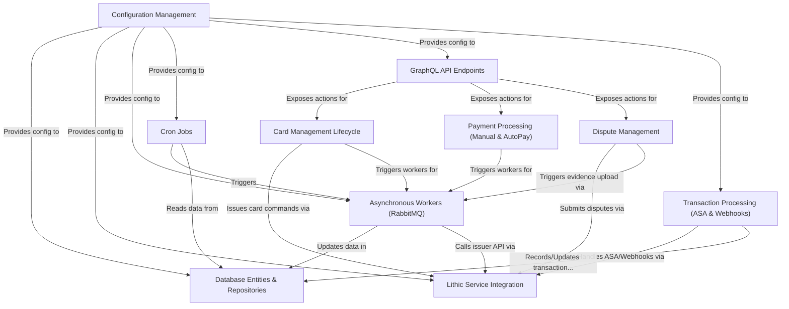

# Tutorial: credit-card-service

This project is a backend *credit card service*.
It handles the entire **lifecycle** of virtual and physical credit cards, including creation, activation, freezing, and closing.
The service processes card **transactions** in real-time (approving or declining) and manages updates via webhooks.
It also manages **payments** (manual and automatic) and handles the **dispute** process for challenged transactions.
Clients interact with the service through a **GraphQL API**, while background tasks are handled by **asynchronous workers** and **scheduled jobs**.
It integrates heavily with **Lithic** as the external card issuer and uses a **PostgreSQL database** for storage.

**Source Repository:** [https://github.com/novohq/credit-card-service](https://github.com/novohq/credit-card-service)

## Chapters

1. [GraphQL API Endpoints](01_graphql_api_endpoints.md)
2. [Card Management Lifecycle](02_card_management_lifecycle.md)
3. [Transaction Processing (ASA & Webhooks)](03_transaction_processing__asa___webhooks_.md)
4. [Payment Processing (Manual & AutoPay)](04_payment_processing__manual___autopay_.md)
5. [Dispute Management](05_dispute_management.md)
6. [Lithic Service Integration](06_lithic_service_integration.md)
7. [Database Entities & Repositories](07_database_entities___repositories.md)
8. [Asynchronous Workers (RabbitMQ)](08_asynchronous_workers__rabbitmq_.md)
9. [Cron Jobs](09_cron_jobs.md)
10. [Configuration Management](10_configuration_management.md)

---

Generated by [AI Codebase Knowledge Builder](https://github.com/The-Pocket/Tutorial-Codebase-Knowledge)